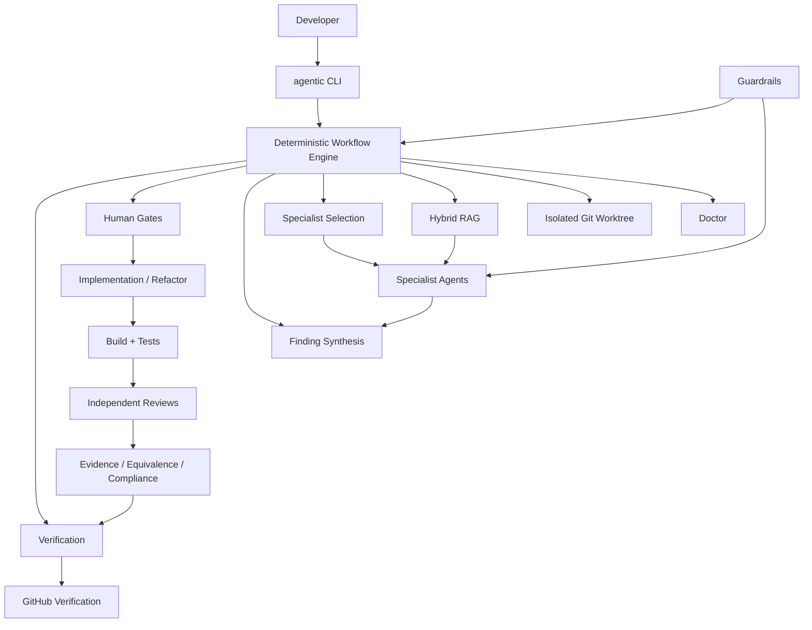
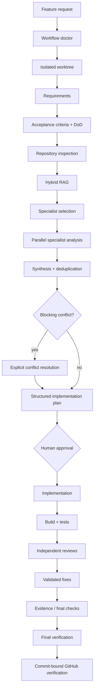
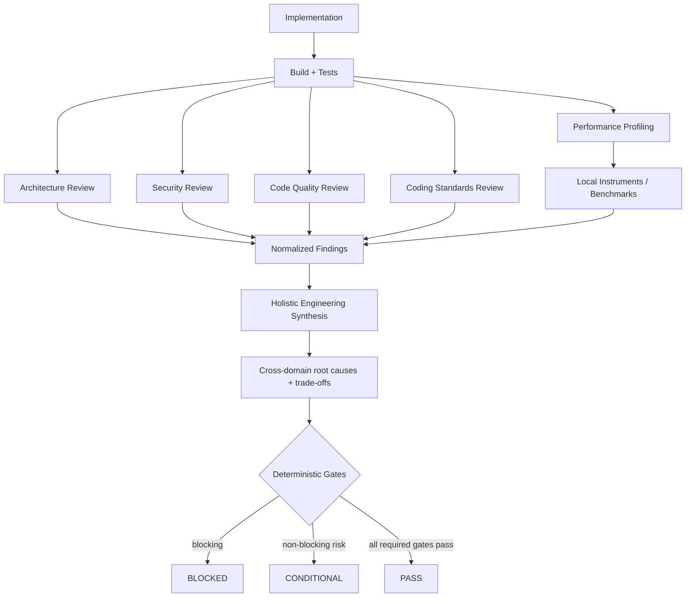

# AI Agent Workflow Runtime

[](https://github.com/mohamedma872/ai-agent-workflow-kit/actions/workflows/ci.yml)


A deterministic, cross-stack **agentic engineering runtime** for Claude Code, Codex, and specialist subagents.

It turns an AI coding agent from “a model that can edit files” into a governed engineering workflow with:

- a standalone CLI
- deterministic workflow stages
- Hybrid RAG over the target repository
- specialist agents with least-privilege contracts
- enforced human approval gates
- behavior-preserving refactor safety
- whole-app architecture assessment and C4 modeling
- Appium-based mobile evidence
- structured artifacts and verification
- runtime/eval hardening
- GitHub verification
- safe self-updates

> Models perform engineering work. The runtime owns progression, permissions, evidence, verification, and completion.

Security reporting and supported security-update versions are documented in [SECURITY.md](SECURITY.md).

---

## Table of contents

- [Why this exists](#why-this-exists)
- [What it provides](#what-it-provides)
- [Supported project types](#supported-project-types)
- [Architecture at a glance](#architecture-at-a-glance)
- [Quick start](#quick-start)
- [Standalone CLI](#standalone-cli)
- [Normal feature workflow](#normal-feature-workflow)
- [Specialist agents](#specialist-agents)
- [Hybrid RAG](#hybrid-rag)
- [Guardrails and human authority](#guardrails-and-human-authority)
- [Run isolation](#run-isolation)
- [Structured artifacts and evidence](#structured-artifacts-and-evidence)
- [Review and observability model](#review-and-observability-model)
- [Behavior-preserving refactoring](#behavior-preserving-refactoring)
- [Whole-application refactor and architecture](#whole-application-refactor-and-architecture)
- [Mobile verification with Appium](#mobile-verification-with-appium)
- [Evals and quality measurement](#evals-and-quality-measurement)
- [GitHub verification and merge enforcement](#github-verification-and-merge-enforcement)
- [Configuration](#configuration)
- [Updates](#updates)
- [Versioning and releases](#versioning-and-releases)
- [Security](#security)
- [Repository layout](#repository-layout)
- [Documentation index](#documentation-index)
- [Development and validation](#development-and-validation)
- [Current status and known limits](#current-status-and-known-limits)
- [License](#license)

---

## Why this exists

AI coding tools can generate code quickly, but code generation alone does not answer engineering questions such as:

```text
Was the right problem understood?
Was the repository inspected before coding?
Were relevant specialists consulted?
Did security or architecture concerns conflict?
Did a human approve the plan?
Did implementation preserve existing behavior?
Was the final build actually tested?
Does the evidence belong to the exact commit/build?
Can the result be reproduced and reviewed?
```

This runtime treats those questions as workflow responsibilities rather than prompt wording.

The core separation is:

```text
Model / agent     → performs engineering work
Workflow engine   → decides what may run next
Guardrails        → decide what tools/actions are allowed
Evals             → test the runtime and agent behavior
Evidence          → proves what was actually verified
Human             → approves plan/architecture-sensitive decisions
```

---

## What it provides

| Capability | Purpose |
|---|---|
| Standalone `agentic` CLI | use the runtime against an existing project |
| Deterministic workflow DAG | stage progression is runtime-owned, not model-owned |
| Project doctor | verify stack/runtime/device prerequisites before execution |
| Git worktree isolation | each run works in an isolated product worktree |
| Hybrid RAG | retrieve focused, role-specific repository evidence |
| Specialist subagents | architecture, security, QA, performance, stack-specific analysis |
| Finding synthesis | deduplicate findings and preserve provenance |
| Conflict tracking | stop planning when specialists materially disagree |
| Human approval gate | prevent agents from approving their own implementation plan |
| Behavior-safe refactor mode | baseline behavior and prove equivalence after refactoring |
| Architecture/C4 workflow | whole-app architecture assessment, alternatives, selection, migration |
| Appium evidence | Android/iOS evidence tied to the tested build |
| Structured artifacts | machine-readable JSON + human-readable Markdown gates |
| Retry/timeout/fallback | bounded execution with persistent attempt history |
| GitHub verification | bind final verification to a specific commit |
| Evals | runtime hardening and specialist quality measurement |
| Self-update | safely update clone + npm-link installations |

---

## Supported project types

The same runtime can operate against:

```text
Android native
iOS native
React Native
Flutter
Frontend
Backend
Generic Git repositories
```

Stack-specific specialists and verification paths are selected dynamically.

Examples:

```text
Android change
  → Android specialist
  → Android reviewer
  → Gradle / Android checks
  → Appium evidence when required

GraphQL / OpenAPI change
  → API-contract specialist
  → API-contract reviewer

Framework / SDK upgrade
  → dependency-migration specialist

React Native feature
  → React Native specialist
  → Android/iOS specialists when native impact exists
```

---

## Architecture at a glance



The product repository and installed runtime remain separate:

```text
Installed Agentic Runtime
        │
        │ agentic
        ▼
Target project
        │
        ├── application source
        ├── tests
        ├── docs / ADRs / API specs
        ├── .agentic/          development configuration
        ├── .agentic-runs/     workflow state · gitignored
        └── .ai-worktrees/     isolated run worktrees · gitignored
```

The runtime is development tooling. It is not imported into the product application's production dependency graph.

---

## Quick start

### 1. Install

Current distribution uses a Git clone plus `npm link`:

```bash
git clone https://github.com/mohamedma872/ai-agent-workflow-kit
cd ai-agent-workflow-kit

npm ci
npm link
```

Verify:

```bash
agentic version
```

Current runtime:

```text
1.8.0
```

### 2. Initialize a project

```bash
cd ~/projects/my-project
agentic init
```

### 3. Check readiness

```bash
agentic doctor
```

### 4. Start a feature

```bash
agentic feature FEAT-001 \
  --request "Add biometric login with password fallback"
```

### 5. Watch progress

```bash
agentic progress
```

Opens the terminal dashboard on the active feature, with every other in-progress feature listed beside it. See [Progress](#progress).

### 6. Approve the generated plan

After reviewing it:

```bash
agentic approve FEAT-001
```

---

## Standalone CLI

### Initialize a repository

```bash
agentic init
```

The initializer detects the project and creates:

```text
.agentic/
├── config.yaml
├── knowledge.yaml
├── guardrails.yaml
└── README.md

.codex/
└── hooks.json

.mcp.json
```

It also ensures these are ignored:

```text
.agentic-runs/
.ai-worktrees/
```

`agentic init` is idempotent and can be rerun after runtime upgrades.

For mobile projects, it preserves existing MCPs and adds Appium MCP when no Appium alias is configured.

### Doctor

```bash
agentic doctor
agentic doctor --scope mobile
agentic doctor --scope frontend
agentic doctor --scope backend
agentic doctor --scope all
```

The doctor checks the relevant environment, for example:

```text
Node
Git
Claude / Codex
MCP configuration
Android SDK / ADB
Xcode / Simulator
Flutter
Appium MCP
frontend tooling
backend runtime/build/test tooling
```

### Progress

Several features can be in progress at once. `agentic progress` with no run id opens a live terminal dashboard focused on the active feature:

```bash
agentic progress              # dashboard, focused on the active run
agentic dashboard --all       # include finished runs
agentic runs                  # list in-progress features (▸ marks the active one)
agentic runs --all --json     # every run, machine-readable
agentic switch FEAT-002       # make a feature the active run
```

```text
╭ AGENTIC · my-app ───────────────────────────────── 3 in progress ╮
├────────────────────┬─────────────────────────────────────────────┤
│ ▸ FEAT-002 *  43%  │ FEAT-002 · Payments retry on timeout        │
│   FEAT-007    12%  │ ██████████░░░░░░░░░░░░░░  43%               │
│   FEAT-011    88%  │ 🔒 plan gate: waiting for human approval    │
│                    │ ✅ Repository Inspection    pass            │
│                    │ 🔄 Specialist Analysis      in_progress     │
│                    │    ✅ architect            pass · claude    │
│                    │    🔄 security             in_progress      │
│                    │ Current: Specialist Analysis → security     │
╰────────────────────┴─────────────────────────────────────────────╯
 ↑↓ select · enter set active · a all runs · r refresh · q quit
```

`↑↓`/`j k` move between features, `enter` makes the highlighted feature the active run (so `agentic resume`, `approve` and `progress` default to it), `c` closes a feature after a confirmation, `a` toggles finished runs, `r` refreshes, `q` quits. The view refreshes every second, and `*` marks the active run.

Closing a feature whose verification has not passed records it as abandoned rather than complete, so an unfinished run never reads as done.

A single run still renders on its own, and piping or redirecting any of these prints one frame instead of taking over the terminal:

```bash
agentic progress FEAT-001
agentic progress FEAT-001 --watch
agentic progress FEAT-001 --json
```

Details: [docs/progress-dashboard.md](docs/progress-dashboard.md).

### Resume

```bash
agentic resume FEAT-001
```

### Worktree

```bash
agentic worktree FEAT-001
```

### Cleanup

```bash
agentic cleanup FEAT-001
agentic cleanup FEAT-001 --force
```

### Target another repository

```bash
agentic --project ~/projects/banking-android doctor
```

```bash
agentic --project ~/projects/payment-backend \
  feature PAY-101 \
  --request "Add idempotency to payment creation"
```

### Command reference

| Command | Purpose |
|---|---|
| `agentic init` | initialize an existing Git project |
| `agentic doctor` | check runtime/project prerequisites |
| `agentic feature <id> --request "..."` | start a feature workflow |
| `agentic resume <id>` | resume a paused workflow |
| `agentic approve <id>` | human approval of the implementation plan |
| `agentic progress [<id>] [--watch]` | dashboard for all in-progress features, or one run |
| `agentic runs [--all] [--json]` | list features and which one is active |
| `agentic switch <id>` | make a feature the active run |
| `agentic refactor <id> --request "..."` | start a behavior-preserving refactor |
| `agentic refactor-app <id> --request "..."` | start a whole-app architecture refactor |
| `agentic architecture <id> <option>` | record the human architecture choice |
| `agentic report <id>` | produce/read refactor verification results |
| `agentic rag --query "..."` | inspect Hybrid RAG directly |
| `agentic worktree <id>` | inspect run worktree state |
| `agentic cleanup <id>` | safely remove a run worktree |
| `agentic version` | display runtime version |
| `agentic update --check` | check for a newer stable runtime |
| `agentic update` | safely update the installed runtime |

---

## Normal feature workflow



The engine, not the model, decides which stage is eligible to run next.

Workflow definition:

```text
ai/workflows/feature.yaml
```

---

## Specialist agents

Subagents are machine-readable roles, not free-form prompts.

Each contract declares:

```text
inputs
outputs
read/write mode
allowed tools
required MCPs
optional MCPs
evidence requirements
state-mutation restrictions
retrieval configuration
```

Contracts:

```text
ai/subagents/contracts.yaml
```

### Analysis roles

| Role | Focus |
|---|---|
| Architecture | boundaries, dependencies, modularity, cross-stack impact |
| Security | trust boundaries, auth, secrets, storage, transport |
| QA plan | acceptance coverage, edge cases, negative paths |
| Performance | hot paths, budgets, measurement plan |
| Android | lifecycle, manifest, permissions, Gradle/native integration |
| iOS | lifecycle, entitlements, privacy, concurrency, signing |
| React Native | Hermes, New Architecture, navigation, native bridges |
| Flutter | widgets/state, plugins, platform channels, flavors |
| Frontend | routing, accessibility, state/data flow, browser behavior |
| Backend | APIs, persistence, transactions, queues, concurrency |
| API contract | OpenAPI/GraphQL compatibility, errors, nullability, pagination |
| Dependency migration | framework/SDK upgrade impact and rollback |
| Docs | version-sensitive framework/library documentation |

### Independent reviewers

After implementation, the runtime can add:

```text
code reviewer
security reviewer
performance reviewer
React Native reviewer
Android reviewer
iOS reviewer
Flutter reviewer
frontend reviewer
backend reviewer
API-contract reviewer
behavior-regression reviewer
architecture-compliance reviewer
```

A pre-implementation specialist does not silently approve its own recommendation.

---

## Hybrid RAG

Repository-reading agents receive a role-specific evidence pack instead of a repository dump.

Retrieval combines:

```text
keyword / BM25-style relevance
lexical-vector similarity
exact symbols
path / metadata relevance
exact phrases
role-aware hints
optional semantic-embedding similarity
              ↓
deterministic reranking
              ↓
per-file diversity
              ↓
context budget
              ↓
source path + exact line-range evidence
```

The semantic-embedding channel is optional and provider-neutral.

The query is built from:

```text
feature/refactor request
requirements
acceptance criteria
Definition of Done
repository inspection
changed files when relevant
active specialist role
```

Sensitive files are excluded, including common:

```text
.env files
credentials/secrets
private keys
PEM/P12/PFX
JKS/keystores
google-services.json
GoogleService-Info.plist
```

Retrieved repository text is treated as **untrusted evidence, not runtime instructions**.

Inspect retrieval directly:

```bash
agentic rag \
  --query "Where is the refresh token stored?" \
  --role security
```

---

## Guardrails and human authority

Guardrails enforce what agents may do, independently of model intent.

They cover:

```text
secret-file protection
credential-leak prevention
runtime/guard self-protection
pre-approval product-write blocking
shell-write detection
destructive command checks
outward-effect checks
role-scoped MCP/tool permissions
fail-closed handling for protected actions
```

Main policy files:

```text
ai/guard.yaml
ai/guard/engine.js
ai/guard/runner.js
ai/guard/subagent-capabilities.js
ai/tasks/feature/guard.js
```

Human-only actions include:

```bash
agentic approve ...
agentic architecture ...
```

Agents are prevented from promoting themselves through those gates.

The authority model is:

```text
Model output          ≠ workflow authority
Agent prose           ≠ evidence
Human gate            = explicit human action
Runtime state         = controlled transition
Verification evidence = exact run/build/commit identity
```

---

## Run isolation

Each run receives an isolated Git worktree.

Standalone mode:

```text
.ai-worktrees/<run-id>/
.agentic-runs/<run-id>/
```

Runtime-development mode uses the runtime's own run state directory.

A run records:

```text
base SHA
current SHA
branch
source repository
worktree path
dirty state
attempt history
stage status
```

Unsafe cleanup is rejected unless force is explicitly requested.

See [docs/run-isolation.md](docs/run-isolation.md).

---

## Structured artifacts and evidence

Important workflow decisions are persisted as artifacts rather than existing only in model conversation history.

Examples include:

```text
requirements
acceptance criteria
Definition of Done
specialist findings
conflicts
implementation plan
build/test results
reviews
architecture assessment/options/selection
behavior baseline/invariants/equivalence
C4 model
verification
device evidence
telemetry
```

Artifacts are stored as human-readable Markdown with structured JSON sidecars where required.

Schemas live in:

```text
ai/workflow/schemas/
```

Invalid, missing, stale, wrong-run, or semantically failing artifacts block stage completion.

See [docs/structured-artifacts.md](docs/structured-artifacts.md).

---

## Review and observability model

The next review layer should be **evidence-first and multi-domain**, not a single generic "review agent".

The recommended model is:



The domain reviewers discover problems independently. The **holistic reviewer** should then reason across domains and identify shared root causes, interactions, and trade-offs.

### Architecture review

Architecture review should compare the **observed architecture** with the expected architecture contract.

Evidence can come from:

```text
module/dependency graph
imports
Gradle modules
Swift packages
npm/package boundaries
DI graph
navigation graph
API interfaces
database ownership
architecture docs / ADRs
target architecture contract
```

Typical checks:

```text
dependency direction
layer violations
cyclic dependencies
feature ownership
domain boundaries
data ownership
coupling / cohesion
state ownership
testability
observability
architecture fitness functions
```

Example finding:

```text
ARCH-014

Expected:
presentation → domain → data

Observed:
presentation → data

Evidence:
feature/login/LoginViewModel.kt:84
imports UserRepositoryImpl directly

Impact:
presentation depends on infrastructure implementation

Recommendation:
depend on the domain-owned repository abstraction
```

For whole-application refactors, architecture fitness rules should be machine-checkable where possible.

Examples:

```text
feature modules cannot depend on another feature implementation
UI cannot depend directly on network/database implementation
domain modules cannot depend on Android/iOS UI frameworks
dependency cycles must equal 0
forbidden dependency count must equal 0
```

### Security review

Security review should combine AI reasoning with local/static evidence rather than relying on model opinion alone.

Recommended evidence sources include:

```text
Semgrep / custom rules
dependency audit
secret scanning
Android manifest / network security config
iOS entitlements / URL schemes
secure-storage configuration
TLS / certificate-pinning configuration
source-level auth/session analysis
runtime/device checks where appropriate
```

Review areas:

```text
authentication / authorization
credential and token storage
session lifecycle / rotation
TLS / pinning
WebView usage
deep links / URL schemes
Android exported components
iOS privacy / entitlements
biometric flows
sensitive logging
cryptography
PII handling
API validation
trust boundaries
```

Security frameworks can be used as review references, for example OWASP MASVS for mobile and OWASP ASVS / Top 10 for web/backend.

### Local performance review

Performance conclusions should be grounded in **measured local evidence**.

The target approach is:

```text
code inspection
      +
local profiler / benchmark
      +
before-vs-after baseline
      ↓
performance reviewer
      ↓
source-correlated findings
```

Recommended local instruments:

| Stack | Instruments / evidence |
|---|---|
| Android | Perfetto, Android Studio Profiler, Macrobenchmark, Benchmark, JankStats, memory/CPU/network traces |
| iOS | Xcode Instruments: Time Profiler, Allocations, Leaks, Memory Graph, Network, Core Animation, Energy Log |
| React Native | native Android/iOS instruments, Hermes profiling, React DevTools/Profiler, bundle metrics |
| Flutter | DevTools CPU/Memory/Performance, frame timing, shader/build metrics |
| Frontend | Lighthouse, Chrome Performance traces, Core Web Vitals, bundle analyzer, React profiler |
| Backend | k6, wrk/autocannon/JMeter, JFR/async-profiler/pprof, OpenTelemetry traces, DB EXPLAIN/slow-query logs |

Useful measured metrics include:

```text
cold / warm startup
P50 / P95 / P99 latency
frame time / jank
CPU
memory / allocations / GC
bundle size
network latency
DB latency
throughput
error rate
energy / battery where relevant
```

A performance finding should connect the metric to the source:

```text
PERF-004

Observed:
Login → Home transition P95 = 720 ms

Trace:
312 ms JSON parsing
205 ms database query
143 ms main-thread image work

Evidence:
Perfetto trace
ProfileRepository.kt:118
HomeViewModel.kt:74

Recommendation:
move parsing off the main thread,
optimize/index the query,
remove synchronous image decoding
```

### Baseline and regression budgets

Performance and behavior-sensitive changes should be compared against a baseline.

Example:

```text
                    Before      After       Change
Cold startup        1.41 s      1.53 s      +8.5%
P95 frame time      15 ms       18 ms       +20%
Peak memory         183 MB      197 MB      +7.6%
API P95             222 ms      220 ms      -0.9%
```

Recommended project configuration can define explicit budgets:

```yaml
performance:
  startup:
    regression_max_percent: 5
  memory:
    regression_max_percent: 10
  frame_time:
    p95_max_ms: 16.7
```

The runtime should treat budget breaches as deterministic gates instead of asking the AI to decide whether a regression is "acceptable".

### Code quality review

Code quality review should combine static analysis with contextual AI review.

Typical concerns:

```text
complexity
duplication
large functions/classes
dead code
responsibility size
coupling / cohesion
error handling
testability
maintainability
abstraction quality
dependency direction
naming / readability
```

Recommended local tools:

| Stack | Tools |
|---|---|
| Kotlin | Detekt, ktlint |
| Java | SpotBugs, Checkstyle, PMD |
| Swift | SwiftLint |
| TypeScript / JavaScript | ESLint |
| Python | Ruff, mypy |
| Dart / Flutter | dart analyze |
| Cross-stack | SonarQube / SonarScanner |

The AI reviewer should consume tool findings and repository context rather than re-inventing static-analysis rules in prose.

### Coding standards review

Project-specific engineering standards should be first-class input.

Recommended project layout:

```text
.agentic/
├── config.yaml
├── knowledge.yaml
├── guardrails.yaml
└── standards/
    ├── architecture.md
    ├── security.md
    ├── testing.md
    ├── kotlin.md
    ├── swift.md
    ├── react-native.md
    └── backend.md
```

A standards reviewer should compare changed code against these local rules and produce evidence-backed violations.

Example:

```text
STD-004

Rule:
ViewModels must not depend directly on Retrofit services.

Observed:
ProfileViewModel.kt:73 → ProfileApi

Expected:
ViewModel → UseCase → Repository
```

### Normalized review findings

All review domains should emit the same structured finding model so synthesis is deterministic.

Example:

```json
{
  "id": "PERF-004",
  "domain": "performance",
  "severity": "high",
  "confidence": 0.97,
  "title": "Main-thread JSON parsing delays startup",
  "evidence": [
    {
      "type": "instrument",
      "source": "perfetto",
      "metric": "mainThreadBlockedMs",
      "value": 312
    },
    {
      "type": "source",
      "file": "ProfileRepository.kt",
      "line": 118
    }
  ],
  "impact": ["startup", "responsiveness"],
  "recommendation": "Move parsing off the main thread.",
  "verification": "Re-run startup benchmark and require budget pass."
}
```

### Holistic engineering reviewer

The holistic reviewer should not simply concatenate specialist output.

It should identify cross-domain relationships such as:

```text
Architecture:
SessionManager is a global dependency used by many modules.

Security:
SessionManager persists credentials insecurely.

Performance:
SessionManager performs synchronous disk work during startup.

Holistic root cause:
session management is a cross-cutting infrastructure dependency with
architecture, security, and startup-performance impact.
```

A holistic report should include:

```text
blocking findings
high-risk findings
cross-domain root causes
architecture impact
security impact
performance impact
code-quality / maintainability impact
standards violations
testing gaps
measured baseline regressions
recommended remediation order
required reverification
```

The AI is responsible for synthesis and explanation; deterministic runtime rules remain responsible for the final gate.

### Review outcome

Avoid a cosmetic overall score such as `83/100` as the primary decision.

Prefer deterministic outcomes:

```text
PASS
CONDITIONAL
BLOCKED
```

Examples:

```text
critical security finding
    → BLOCKED

unexpected behavior regression
    → BLOCKED

required performance budget exceeded
    → BLOCKED

high maintainability issue with accepted debt
    → CONDITIONAL

all required gates/evidence pass
    → PASS
```

### Target review pipeline

The target post-implementation flow is:

```text
Implementation
      ↓
Build + Tests
      ↓
Static Analysis
      ↓
┌─────────────────────────────────────────────┐
│ Architecture Review                        │
│ Security Review                            │
│ Code Quality Review                        │
│ Coding Standards Review                    │
│ Performance Profiling + Local Instruments  │
│ Platform-specific Runtime Review           │
└─────────────────────────────────────────────┘
      ↓
Normalized Evidence-backed Findings
      ↓
Holistic Engineering Synthesis
      ↓
Cross-domain Root Causes + Trade-offs
      ↓
Fixes
      ↓
Reverification
      ↓
Deterministic PASS / CONDITIONAL / BLOCKED
      ↓
Final Verification
```

### Current implementation status

The runtime already includes several pieces of this model:

```text
architecture/security/performance specialists
independent code/security/performance reviewers
stack-specific reviewers
architecture compliance review
behavior regression review
structured evidence-backed findings
finding synthesis / conflict tracking
runtime and specialist evals
Appium exact-build evidence
final verification
```

The following are the recommended next layer and should not yet be treated as fully automated runtime capabilities:

```text
first-class adapters for Perfetto / Instruments / Lighthouse / k6 / profiler output
project-local .agentic/standards/ review pipeline
automatic before/after performance-baseline capture
generic performance-budget enforcement
dedicated code-quality / coding-standards reviewer stages
final holistic-engineering-review artifact and deterministic gate
```

## Behavior-preserving refactoring

Refactor mode treats **observable behavior equivalence** as the success criterion.

Start:

```bash
agentic refactor RF-001 \
  --request "Refactor authentication without changing behavior"
```

Flow:

```text
impact / inspection
      ↓
behavior baseline
      ↓
preservation invariants
      ↓
characterization coverage gate
      ↓
specialist analysis
      ↓
refactor plan
      ↓
human approval
      ↓
verified increments
      ↓
scope-aware build/test matrix
      ↓
behavior-regression review
      ↓
contract diff
      ↓
behavior-equivalence gate
      ↓
final verification
```

The baseline can cover:

```text
public APIs
state transitions
side effects
network/API behavior
storage keys/formats
navigation/deep links
analytics
errors/fallbacks
concurrency/ordering
lifecycle/background behavior
known unverified scenarios
```

Unexpected behavior changes fail equivalence.

Generate the final report:

```bash
agentic report RF-001
```

---

## Whole-application refactor and architecture

Whole-app refactoring adds an architecture decision workflow before implementation.

Start:

```bash
agentic refactor-app APP-001 \
  --request "Modernize the complete application architecture without changing behavior"
```

The runtime produces:

```text
architecture assessment
2-4 architecture options
trade-offs and weighted criteria
advisory recommendation
C4 previews
migration complexity/reversibility
team/operations/security/performance/testability impact
```

The human selects the target:

```bash
agentic architecture APP-001 B
```

The runtime then generates:

```text
selected target architecture
dependency/boundary contract
C4 model
Structurizr DSL
migration waves
rollback points
architecture fitness functions
implementation plan
```

Architecture-as-code is promoted into:

```text
docs/architecture/
├── README.md
├── target-architecture.md
├── target-architecture.json
├── c4-model.md
├── c4-model.json
├── workspace.dsl
├── migration-plan.md
├── migration-plan.json
└── decisions/<run-id>/
```

After implementation, an independent architecture-compliance review runs before final behavior-equivalence verification.

---

## Mobile verification with Appium

For mobile/UI workflows requiring device evidence:

```text
final post-fix build
      ↓
Appium Android / iOS session
      ↓
acceptance-criteria-driven checks
      ↓
fresh screenshots + QC manifest
      ↓
exact-build evidence attestation
      ↓
final verification
```

Evidence binds to:

```text
run ID
attempt ID
Git SHA
workspace fingerprint
real Appium session metadata
device identity
package/bundle identity
APK/AAB/IPA/.app SHA-256 where applicable
build/version metadata
screenshot hashes
manifest hash
```

Partial, stale, copied, wrong-platform, wrong-attempt, or wrong-build evidence cannot satisfy a required mobile verification gate.

Appium MCP aliases recognized by the doctor:

```text
appium
appium-mcp
mcp-appium
```

Appium MCP requires Node 22+. The core runtime itself supports Node 20+. The standard entry `agentic mcp appium` runs Appium MCP on an installed Node 22+ (nvm, fnm, Volta, asdf, n or Homebrew) even when your default Node is 20, and `agentic init` migrates older `npx appium-mcp` entries to it.

See:

- [docs/mobile-evidence-runner.md](docs/mobile-evidence-runner.md)
- [docs/mobile-evidence-attestation.md](docs/mobile-evidence-attestation.md)
- [docs/workflow-doctor.md](docs/workflow-doctor.md)

---

## Evals and quality measurement

The runtime includes deterministic hardening checks and specialist evals.

### Runtime health

```bash
npm run exam:check
```

Hardening covers areas such as:

```text
state-forging attempts
guard weakening
stale/partial evidence
retry/resume/fallback
concurrent worktree isolation
behavior-preserving refactor regressions
stack-specific workflows
```

### Specialist evals

```bash
npm run exam:subagents:check
npm run exam:subagents:selftest
```

Live specialist trials:

```bash
npm run exam:subagents:live
```

Live trials require authenticated local model tooling and consume model budget, so they are not run in normal CI.

### Metrics

The reporting layer can track:

```text
precision
recall
false-positive rate
severity-weighted misses
latency
attempt count
retry count
executor
cost when available
findings produced
findings retained after synthesis
review resolution state
```

See [docs/runtime-hardening-evals.md](docs/runtime-hardening-evals.md).

---

## GitHub verification and merge enforcement

After final verification, the runtime can publish a commit-bound GitHub status:

```text
agentic-workflow-verification
```

The verification is tied to the expected commit SHA and uses a sanitized allowlisted summary.

It does not publish:

```text
prompts
screenshots
diff contents
review prose
logs
secrets
```

Recommended required checks:

```text
validate
agentic-workflow-verification
```

Repository-administration capability is separate from runtime correctness. Required-status enforcement still depends on repository/admin account capabilities.

See:

- [docs/github-verification.md](docs/github-verification.md)
- [docs/github-merge-enforcement.md](docs/github-merge-enforcement.md)

---

## Configuration

### Runtime workflow

```text
ai/workflows/feature.yaml
```

Defines:

```text
stages
dependencies
conditional roles
execution policies
human gates
review stages
verification flow
```

### Agent/executor configuration

```text
ai/agents.yaml
```

### Role contracts

```text
ai/subagents/contracts.yaml
```

### Guard policy

```text
ai/guard.yaml
```

### Project configuration

Created by `agentic init`:

```text
.agentic/config.yaml
.agentic/knowledge.yaml
.agentic/guardrails.yaml
```

### MCP configuration

Project-level:

```text
.mcp.json
```

The runtime also discovers supported user-level Claude/Codex MCP configuration where applicable.

---

## Updates

Check:

```bash
agentic update --check
```

Machine-readable:

```bash
agentic update --check --json
```

Apply:

```bash
agentic update
```

Current clone + `npm link` update safety:

```text
fetch origin/main
      ↓
verify runtime clone is clean
      ↓
refuse custom/contributor branches
      ↓
require safe fast-forward
      ↓
update runtime
      ↓
npm ci
      ↓
npm link
      ↓
runtime version validation
      ↓
standalone CLI self-test
      ↓
external-project isolation self-test
      ↓
success
```

If post-update installation/verification fails, the updater restores the previous runtime commit and attempts to restore dependencies and linking.

The updater modifies only the installed runtime clone, not the target application repository.

---

## Versioning and releases

Authoritative metadata:

```text
ai/runtime-version.json
```

Current:

```text
runtimeVersion         1.8.0
workflowFormatVersion  1
artifactSchemaVersion  1
releaseChannel         stable
```

Validate:

```bash
npm run workflow:version
npm run workflow:version:check
npm run workflow:release:check
```

Release helper:

```bash
npm run workflow:release -- notes
npm run workflow:release -- tag --dry-run
npm run workflow:release -- tag
npm run workflow:release -- tag --push
```

A pushed `vX.Y.Z` tag triggers the GitHub **Runtime Release** workflow, which validates runtime metadata and creates the GitHub Release.

See:

- [CHANGELOG.md](CHANGELOG.md)
- [docs/releases.md](docs/releases.md)
- [docs/migrations/](docs/migrations/)

---

## Security

Supported security-update versions and reporting guidance:

[SECURITY.md](SECURITY.md)

Security-sensitive areas include:

```text
human-gate bypass
workflow-state forgery
guardrail bypass
unauthorized file writes
secret/credential leakage
prompt-injection escalation
MCP capability escalation
unsafe updater behavior
worktree/path isolation failures
forged/stale verification evidence
wrong-build device evidence
wrong-commit GitHub verification
```

Do not disclose vulnerability details in a public issue.

---

## Repository layout

```text
.
├── ai/
│   ├── cli/                 # standalone CLI + updater
│   ├── evals/               # runtime/specialist evals
│   ├── guard/               # guard engine and hooks
│   ├── mcp/                 # MCP integrations
│   ├── rag/                 # Hybrid RAG
│   ├── subagents/           # role contracts
│   ├── tasks/               # task adapters and evidence runners
│   ├── workflow/            # engine, router, progress, verification, schemas
│   └── workflows/           # deterministic workflow DAG
│
├── docs/                    # detailed documentation and migrations
├── .github/workflows/       # CI and release automation
├── SECURITY.md
├── CHANGELOG.md
├── AGENTS.md
├── CLAUDE.md
└── README.md
```

Important implementation files:

| File | Purpose |
|---|---|
| `ai/cli/agentic.js` | standalone CLI |
| `ai/cli/update.js` | safe runtime updater |
| `ai/workflow/engine.js` | deterministic stage runner |
| `ai/workflow/router.js` | role/executor routing |
| `ai/workflow/doctor.js` | prerequisite preflight |
| `ai/workflow/worktree.js` | run isolation |
| `ai/workflow/subagent-selector.js` | dynamic specialist selection |
| `ai/workflow/finding-synthesis.js` | finding deduplication/provenance |
| `ai/workflow/conflict-tracker.js` | specialist conflict detection |
| `ai/rag/hybrid-rag.js` | Hybrid RAG retrieval |
| `ai/guard/engine.js` | guard policy engine |
| `ai/tasks/feature/mobile-evidence.js` | Appium evidence execution |
| `ai/tasks/feature/evidence-attestation.js` | exact-build evidence binding |
| `ai/workflow/github-verification.js` | commit-bound GitHub status |
| `ai/workflow/refactor-cli.js` | refactor/whole-app CLI flow |
| `ai/workflow/version.js` | runtime compatibility/version checks |
| `ai/workflow/release.js` | release/tag tooling |

---

## Documentation index

### Runtime and execution

- [Workflow doctor](docs/workflow-doctor.md)
- [Progress dashboard](docs/progress-dashboard.md)
- [Execution policy](docs/execution-policy.md)
- [Run isolation](docs/run-isolation.md)
- [Structured artifacts](docs/structured-artifacts.md)
- [Guard failure mode](docs/guard-failure-mode.md)

### Mobile

- [Flutter support](docs/flutter-support.md)
- [Mobile evidence runner](docs/mobile-evidence-runner.md)
- [Mobile evidence attestation](docs/mobile-evidence-attestation.md)

### GitHub / CI

- [GitHub verification](docs/github-verification.md)
- [GitHub merge enforcement](docs/github-merge-enforcement.md)

### Quality / evals

- [Runtime hardening evals](docs/runtime-hardening-evals.md)

### Releases

- [Release process](docs/releases.md)
- [Migration notes](docs/migrations/)

### Additional internal references

- [Agent instructions](AGENTS.md)
- [Claude integration](CLAUDE.md)
- [Runtime internals](ai/README.md)
- [MCP integration](ai/mcp/README.md)
- [Eval internals](ai/evals/README.md)

---

## Development and validation

Install:

```bash
npm ci
```

Core validation:

```bash
npm run workflow:version:check
npm run workflow:release:check
npm run guard:check
npm run guard:selftest
npm run workflow:check
npm run workflow:artifacts:check
npm run workflow:subagents:check
npm run agentic:selftest
npm run exam:check
npm run exam:subagents:check
```

Useful targeted checks:

```bash
npm run workflow:rag:selftest
npm run workflow:subagents:select:selftest
npm run workflow:subagents:synthesis:selftest
npm run workflow:refactor:gates:selftest
npm run workflow:refactor:equivalence:selftest
```

CI validates syntax, release metadata, executable CLI mode, guard behavior, workflow configuration, doctor behavior, evidence, hardening evals, routing, MCP imports, and standalone-project isolation.

---

## Core design rules

```text
Model output is not workflow authority.
Agent prose is not evidence.
A reviewer cannot silently approve its own earlier analysis.
Read-only agents do not get write access.
Undeclared MCPs are not available to a role.
Parallel findings are synthesized before planning.
Explicit disagreements become explicit conflicts.
Unresolved blocking conflicts stop progression.
Mobile evidence must belong to the exact tested build.
Final workflow success is bound to the exact commit SHA.
Human approval remains a real gate.
```

---

## Current status and known limits

Implemented and CI-covered:

```text
standalone CLI
external-project execution
Hybrid RAG
specialist role contracts
guardrails
human plan gate
behavior-preserving refactor
whole-app architecture/C4 flow
Appium evidence
structured verification artifacts
runtime/specialist evals
GitHub verification publishing
safe runtime updater
version/release tooling
security policy
```

Current distribution is still **Git clone + npm link**. Native installers/Homebrew/WinGet packaging are not yet the default distribution path.

The full Review & Observability layer described above is a roadmap/target architecture where explicitly marked; local profiler adapters and holistic review gating are not yet fully automated.

Hybrid RAG's semantic embedding channel is optional; the runtime does not automatically provision an external vector database or embedding provider.

Repository-level required-status enforcement depends on GitHub repository/account administration capabilities and must be configured separately from the runtime.

---

## License

MIT · Mohamed Elsdody
