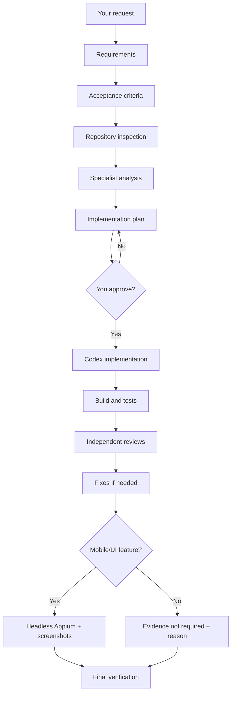
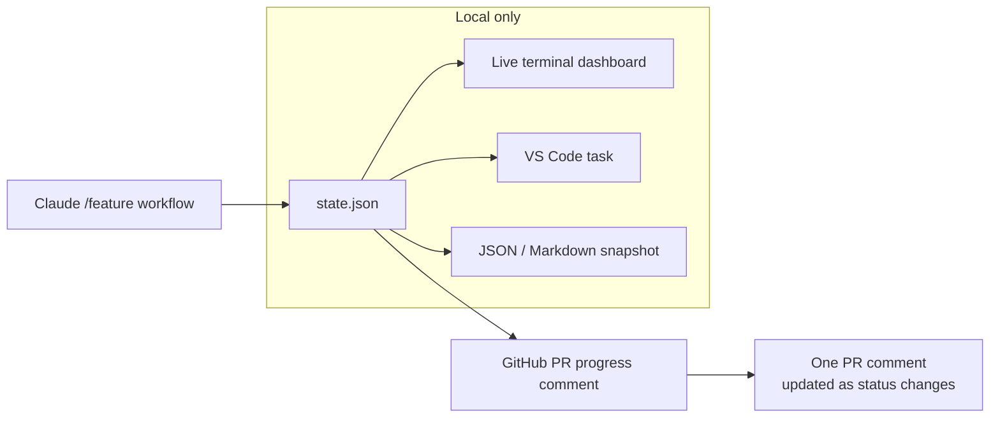
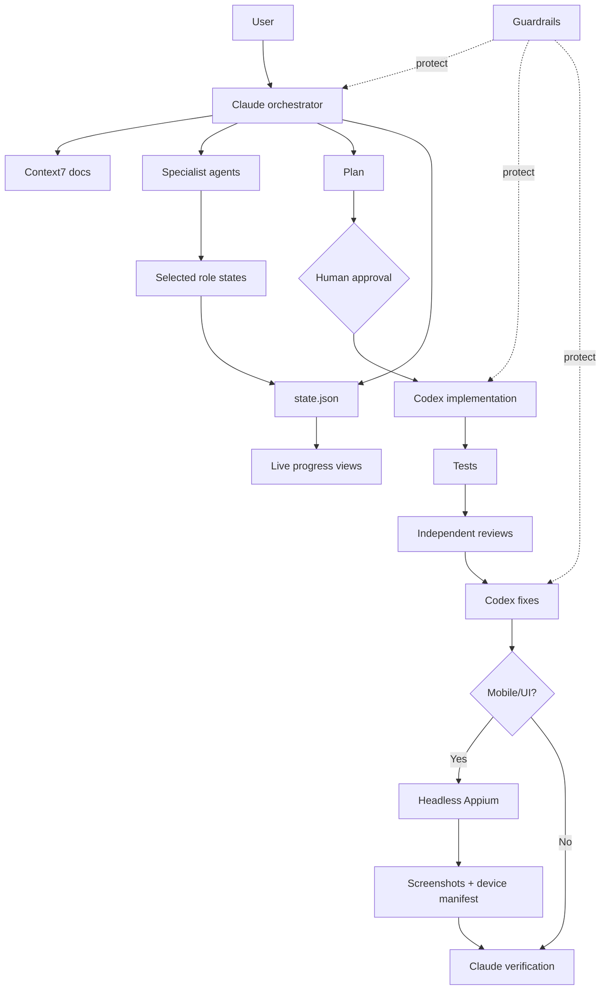

# AI Agent Workflow Kit

A practical workflow for using **Claude Code + Codex** on real software tasks without letting agents jump straight into code.

The basic idea:

```text
You ask for a feature
        ↓
Claude understands and plans it
        ↓
Specialist agents analyze it
        ↓
You approve the plan
        ↓
Codex implements it
        ↓
Tests + reviews verify it
        ↓
Final Appium evidence for mobile/UI
        ↓
Claude gives you the final result
```

At the same time, **guardrails** protect the repository and **evals** check whether the agents actually did the job correctly.

---

## What this project gives you

| Capability | What it means |
|---|---|
| **Agentic workflow** | Requirements → analysis → plan → approval → implementation → tests → reviews → verification. |
| **Live progress** | Watch the active workflow in the terminal, VS Code, JSON, or an updating GitHub PR comment. |
| **Claude + Codex delegation** | Claude coordinates the work. Codex handles implementation and fixes by default. |
| **Guardrails** | Agents are blocked from dangerous actions such as reading secrets, force-pushing, bypassing hooks, or editing protected workflow files. |
| **Current documentation** | Context7 gives agents current library/framework documentation instead of relying only on model memory. |
| **Mobile QA evidence** | Mobile/UI features finish with headless Appium validation and screenshots stored with the run evidence. |
| **Evals** | Tasks are graded from the final repository state, not from what the agent claims it did. |

---

# The main workflow

Use:

```text
/feature <your request>
```

Example:

```text
/feature Add biometric login with password fallback
```

The workflow follows this path:



The important part is the **human approval gate**:

> No product-code implementation should start until you approve the plan.

---

# Live workflow progress

The workflow stores progress in:

```text
ai/runs/<run-id>/state.json
```

That file remains the single source of truth. The progress layer only **renders** it; it does not create a separate workflow state.

## How the visualization works



`ai/runs/` stays gitignored. Prompts, detailed agent output, test evidence, screenshots, and local artifacts are **not published to GitHub** by the progress feature.

Only a safe status summary can be sent to the PR.

## Terminal dashboard

Run once:

```bash
npm run workflow:progress
```

Watch it live:

```bash
npm run workflow:progress:watch
```

Example:

```text
╭────────────────────────────────────────────────────────────╮
│  FEATURE: PAYMENTS-123                        46%           │
╰────────────────────────────────────────────────────────────╯
   █████████████░░░░░░░░░░░░░░░  46%

 ✅ Request                  pass
 ✅ Requirements             pass
 ✅ Acceptance Criteria      pass
 ✅ Definition of Done       pass
 ✅ Repository Inspection    pass
 🔄 Specialist Analysis      in_progress
      ✅ docs                pass · claude
      ✅ architect           pass · claude
      ✅ qa-plan             pass · claude
      🔄 security            in_progress · claude
      ✅ performance         pass · claude
      ⏳ android             pending · claude
      ⏭ ios                 skipped · claude
 ⏳ Implementation Plan      pending
 🔒 Human Approval           pending
 ⏳ Implementation           pending
 ⏳ Build + Tests            pending
 ⏳ Independent Reviews      pending
 ⏳ Validated Fixes          pending
 ⏳ Final Verification       pending

 Current: Specialist Analysis → security
 Plan gate: 🔒 waiting for human approval
```

The dashboard understands both **phase status** and individual parallel **role status**, so `analysis` and `reviews` do not appear as one opaque step.

## Automatic state reconciliation

Parallel phases are closed from the selected role states instead of relying on the orchestrator to remember a second manual update.

Before launching parallel analysis or reviews, the workflow registers the exact roles selected for that run:

```bash
node ai/tasks/feature/runs.js select-roles analysis architect qa-plan security
node ai/tasks/feature/runs.js select-roles reviews code-review security-review performance-review
```

Each role then reports its own status with `set-role`. When all selected roles reach terminal states, the parent phase is derived automatically:

```text
architect ✅
qa-plan   ✅
security  ✅
     ↓
Specialist Analysis ✅ pass
```

The same behavior applies to independent reviews.

Human approval also reconciles the plan consistently: approving a valid plan records both `plan = pass` and `approval = pass`.

For older runs created before selected-role tracking, repair safe derived state with:

```bash
node ai/tasks/feature/runs.js reconcile
```

The renderer is defensive too. If an old `state.json` still contains contradictory values such as:

```text
Specialist Analysis   in_progress
  architect           pass
  security            pass
  qa-plan             pass
Implementation Plan   in_progress
Human Approval        pass
```

it will no longer report `Current: Specialist Analysis`. It uses the effective dependency state, prefers the furthest downstream active stage, and displays a warning showing which stored values were stale.

## VS Code / editor view

This repo includes `.vscode/tasks.json`.

Open the repository root in VS Code, then:

```text
Cmd/Ctrl + Shift + P
→ Tasks: Run Task
→ AI Workflow: Live Progress
```

This opens a **dedicated terminal panel that stays running and refreshes** while `state.json` changes.

> **Important:** `AI: Workflow show` is not the live dashboard. It prints the workflow definition once and exits. `AI: Feature workflow status` also prints only a one-time snapshot. For continuous updates, use `AI Workflow: Live Progress`.

The included tasks are:

| VS Code task | What it does |
|---|---|
| `AI: Guard check` | Runs the guard configuration check once. |
| `AI: Workflow show` | Prints the workflow definition once. This is **not** live progress. |
| `AI: Feature workflow status` | Prints the current run state once. |
| `AI Workflow: Live Progress` | Runs `npm run workflow:progress:watch` and continuously refreshes the local dashboard. |
| `AI Workflow: Progress Snapshot` | Prints one formatted progress dashboard snapshot. |
| `AI Workflow: Live GitHub PR Progress` | Keeps one GitHub PR progress comment synchronized while the workflow runs. |
| `AI Workflow: Update GitHub PR Progress Once` | Updates the PR progress comment once and exits. |
| `AI: Verify repo` | Runs guard, workflow, and exam validation checks. |

If the task does not appear, confirm VS Code is opened at the project root and that this file exists:

```bash
ls .vscode/tasks.json
```

You can always bypass VS Code Tasks and start the watcher directly:

```bash
npm run workflow:progress:watch
```

The terminal should remain open. If it exits immediately, check that there is an active run:

```bash
node ai/tasks/feature/runs.js status
```

and verify the active run marker/state exists under `ai/runs/`.

This task setup also works in editors that understand VS Code-compatible task definitions.

## JSON output

For another UI, script, extension, or dashboard:

```bash
npm run workflow:progress:json
```

This produces machine-readable workflow state without exposing the full run artifacts.

## GitHub PR progress

You can surface the same workflow directly on the feature PR.

One update:

```bash
npm run workflow:progress:github
```

Keep the PR comment synchronized while the workflow runs:

```bash
npm run workflow:progress:github:watch
```

The command maintains **one comment** and edits it when progress changes instead of adding a new comment every time.

## Progress states

```text
✅ pass
🔄 in_progress
⏳ pending
🔒 human approval pending
⛔ blocked
❌ fail
⏭ skipped
```

---

# Who does what?

| Role | Responsibility |
|---|---|
| **Claude** | Orchestrates the workflow, requirements, analysis, planning, reviews, final device evidence, and verification. |
| **Codex** | Implements the approved plan and fixes validated review findings by default. |
| **Specialists** | Focused architecture, security, QA, performance, Android, iOS, backend, frontend, and code-review analysis. |
| **Human** | Approves the implementation plan before product code can be changed. |

Claude does not need to do all coding itself. Implementation and fixes can be delegated through the local `codex-delegate` MCP server.

Large context stays in:

```text
ai/runs/<run-id>/
```

instead of being copied repeatedly between agents.

---

# Current documentation with Context7

For version-sensitive questions, the workflow can use **Context7** so agents do not depend only on model memory.

```text
Repository dependency/version
        ↓
Docs researcher
        ↓
Context7
        ↓
Short current-doc decision
        ↓
Plan / implementation / review
```

Useful for framework upgrades, deprecated APIs, SDK setup, migrations, build settings, and changing APIs.

---

# Final mobile evidence with Appium

For mobile/UI features, Appium is not only an optional test tool. The finished post-fix feature must produce screenshot evidence before final verification can pass.

During repository inspection, classify the feature:

```bash
# Mobile or device-visible UI feature
node ai/tasks/feature/runs.js evidence required "mobile/UI feature"

# Non-mobile/non-UI work
node ai/tasks/feature/runs.js evidence not-required "backend-only change"
```

For required mobile evidence, the final Appium run happens **after implementation, reviews, and fixes**.

```text
Finished feature
      ↓
Headless Appium
      ↓
Run device acceptance criteria
      ↓
Capture screenshots
      ↓
ai/runs/<id>/device/
      ↓
Final verification
```

Evidence is stored locally as:

```text
ai/runs/<id>/device/
├── mobile-device-qc.md
└── screenshots/
    ├── 01-launch.png
    ├── 02-ac-1-success.png
    ├── 03-ac-2-error-state.png
    └── ...
```

Use Appium MCP with `NO_UI=true`. When the project/platform supports it, run the emulator/simulator without a visible window too. The agent still captures screenshots with Appium and saves them to files.

The manifest maps screenshots back to acceptance criteria:

```text
| AC | result | screenshot |
|---|---|---|
| AC-1 | PASS | device/screenshots/02-ac-1-success.png |
| AC-2 | PASS | device/screenshots/03-ac-2-error-state.png |
```

For a normal mobile/UI run, `verification = pass` is rejected when:

- evidence is still `unclassified`;
- screenshots are required but the screenshot folder is empty; or
- `device/mobile-device-qc.md` is missing.

If Appium/device/build access is unavailable, the workflow must report `blocked` / `pending-device` instead of pretending the feature is verified.

The detailed reusable procedure is:

```text
.claude/skills/mobile-device-qc/SKILL.md
```

---

# What is MCP here?

Think of MCP as a **bridge between an AI agent and another capability**.

| MCP | Purpose |
|---|---|
| **codex-delegate** | Claude hands implementation/fix work to Codex |
| **Context7** | Current framework/library documentation |
| **Atlassian** | Jira and Confluence context |
| **Appium** | Android/iOS device testing and final screenshot evidence |
| **Playwright** | Optional browser testing |
| **GitHub** | Optional PR/CI/repository context |

Each role should only get the tools it needs.

More detail: [`ai/mcp/README.md`](ai/mcp/README.md)

---

# Guardrails

The agents run behind the shared policy in:

```text
ai/guard.yaml
```

It protects against things such as:

- reading secret files;
- leaking credentials;
- force-pushing;
- bypassing Git hooks;
- destructive shell commands;
- unexpected publishing/deployment;
- modifying guard/workflow files to make a task pass;
- implementation before human approval.

Inspect active rules with:

```bash
npm run guard:explain
```

---

# Evals

Evals answer:

> Did the agent actually solve the task?

They check the real end state: files, diffs, tests, required artifacts, forbidden changes, and completion evidence.

Fast/free health check:

```bash
npm run exam:check
```

Live comparison:

```bash
node ai/evals/auto.js live --tasks coding
```

More detail: [`ai/README.md`](ai/README.md)

---

# Quick start

```bash
git clone https://github.com/mohamedma872/ai-agent-workflow-kit
cd ai-agent-workflow-kit
npm install
cp .mcp.json.example .mcp.json
```

Validate:

```bash
npm run guard:check
npm run guard:selftest
npm run workflow:check
npm run exam:check
```

Inspect the workflow definition once:

```bash
npm run workflow:show
```

Start the live progress view:

```bash
npm run workflow:progress:watch
```

Then use Claude Code:

```text
/feature <request>
```

---

# Important files

| File | Why it matters |
|---|---|
| `README.md` | High-level explanation and progress visualization |
| `ai/workflows/feature.yaml` | Workflow stages and role routing |
| `ai/workflow/progress.js` | Terminal / JSON / Markdown progress renderer and consistency detection |
| `ai/workflow/progress-selftest.js` | Regression checks for stale/contradictory workflow states |
| `ai/workflow/github-progress.js` | Safe single-comment GitHub PR progress publisher |
| `ai/tasks/feature/runs.js` | Local phase/per-role state store, evidence gate, and automatic reconciliation |
| `.vscode/tasks.json` | Editor tasks for checks, snapshots, and live progress |
| `ai/agents.yaml` | Claude/Codex launch definitions |
| `ai/guard.yaml` | Safety rules |
| `.claude/skills/feature/SKILL.md` | Claude orchestration procedure |
| `.claude/skills/mobile-device-qc/SKILL.md` | Final headless Appium screenshot procedure |
| `ai/mcp/README.md` | MCP/tool setup |
| `ai/README.md` | Advanced guardrail/eval reference |

---

# Architecture



---

## Advanced details

- [`ai/README.md`](ai/README.md) — guard engine, eval framework, exam automation and operations.
- [`ai/mcp/README.md`](ai/mcp/README.md) — Context7, Atlassian, Codex delegation, GitHub, Playwright and Appium setup.
- [`AGENTS.md`](AGENTS.md) — rules every coding agent must follow.
- [`.claude/skills/feature/SKILL.md`](.claude/skills/feature/SKILL.md) — detailed `/feature` orchestration flow.

---

MIT · Mohamed Elsdody