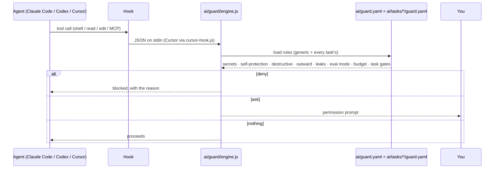
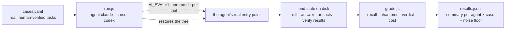
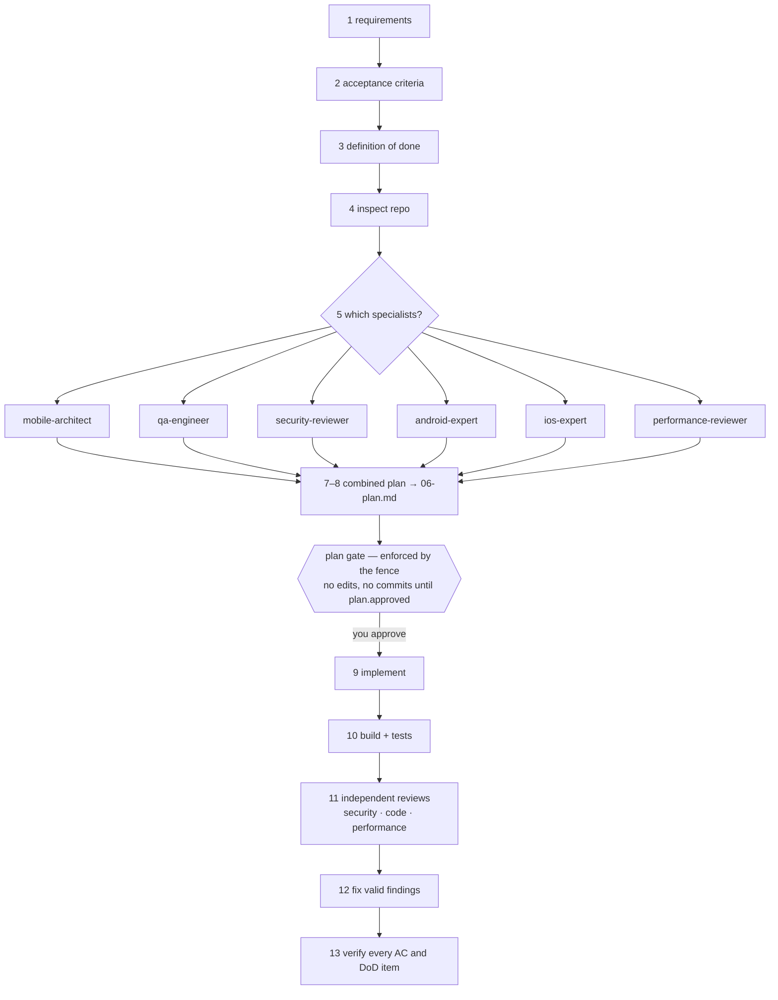

# AI guardrails + evals + agentic workflow — for any coding agent

A drop-in `ai/` folder that puts a **fence** around every AI agent working in a
repository (Claude Code, Cursor, Codex, anything that commits) and an **exam**
that measures them on the same tasks. Rules and test cases are plain YAML you
can read and edit; the JavaScript is only an engine. Includes a 13-step
delivery workflow with specialist subagents and an **enforced** "plan before
editing" gate.

```bash
git clone https://github.com/mohamedma872/ai-guardrails-evals && cd ai-guardrails-evals
npm install                              # js-yaml + husky (installs the git hooks)
node ai/guard/engine.js --check          # validate the YAML rules
node ai/guard/engine.js --explain        # print the active rules and which agents are wired
node ai/guard/engine.js --selftest       # 66 behaviour checks, no agent needed
node ai/evals/run.js                     # the example tasks
```

## Why

Prompts persuade; hooks enforce. A rule that lives in a system prompt is a
wish. A rule that runs *before* the tool call, outside the model, is a fence.
And a claim that an agent "works" is a wish until an eval grades what it left
on disk. This kit gives you both, for every agent, from one set of files.

## What happens on every tool call



Whatever the agent, git adds a second fence for everyone: `pre-commit`
refuses staged credential files and token-shaped content; `pre-push` refuses
history rewrites.

## Layout

```
ai/
├── README.md              the complete reference (fence, packs, exam, workflow, operations)
├── guard.yaml             THE RULES in plain words — edit this
├── agents.yaml            how to run each agent headlessly for evals: claude · cursor · codex
├── guard/
│   ├── engine.js          reads the YAML on every tool call; --check · --explain · --selftest
│   ├── cursor-hook.js     Cursor payload adapter
│   ├── git-pre-commit.js  git-level fence for everyone (secrets)
│   └── git-pre-push.js    git-level fence for everyone (force pushes)
├── tasks/
│   ├── _template/         TASK.md · guard.yaml · guard.js · cases.yaml · adapter.js
│   ├── coding/            any agent: plain repo tasks, graded by end state
│   └── feature/           the /feature workflow: plan gate (guard.js), runs.js, exam of the workflow
├── runs/<id>/             one folder per /feature run (artifacts per step)
└── evals/
    ├── run.js             node ai/evals/run.js <task> run --agent claude|cursor|codex
    └── grade.js           end-state grader: recall, phantoms, verdict, cost; oracle/null self-checks
AGENTS.md                  the instructions every agent reads
CLAUDE.md · .claude/       Claude Code wiring: settings (hooks), rules, commands, skills (feature, ai-task), agents (7 specialists)
.cursor/                   Cursor wiring: hooks.json + a rule that points at AGENTS.md
.codex/                    Codex wiring: hooks.json (same contract as Claude Code)
.husky/                    git wiring for everyone
```

## The fence (`ai/guard.yaml`)

| # | Rule | Effect |
|---|---|---|
| 1 | Secrets shield | `.env*`, keystores, MCP config, service accounts, private keys are never read or dumped into the context (deny) |
| 2 | Self-protection | Editing the rules, hooks, settings or instructions asks the user |
| 3 | Destructive shell | Recursive deletes outside build dirs, history-rewriting git, SQL drops, `curl \| sh`, container/cluster deletes, device wipes, `sudo` ask; force-push is denied |
| 4 | External effects | Writes through outward MCP servers (Jira, Slack, Gmail, Calendar, Linear, GitHub …), store/registry uploads, PR merges, deploys ask; reads pass |
| 5 | Credential leak | Token shapes (AWS, Atlassian, GitHub, Slack, Anthropic, Google, private keys, JWT) or a task's declared secret values in files, commits, or payloads are denied |
| 6 | Eval mode | `AI_EVAL=1`: no commit/push, no outward writes — trials never leave traces |
| 7 | Session budget | Every `AI_SESSION_BUDGET_USD` (default $50) of spend, one confirmation (Claude Code) |

Task packs (`ai/tasks/<task>/guard.yaml`) add secret files, guarded files,
evidence folders and shell rules; `guard.js` is only for checks that must read
run state (a gate, a budget).

## The exam (`ai/evals/`)



Same cases, same grader, every agent — so the numbers are comparable. Plumbing
failures (timeouts, missing artifacts) are `error`/`incomplete` rows, never
zeros. `--oracle` and `--null` prove the grader before a paid run.

## The delivery workflow (`/feature`, Claude Code)



Every step writes a file under `ai/runs/<id>/`, so a run is readable,
resumable, and gradeable. The seven specialists are read-only; the
orchestrator edits.

## Wiring per agent

| Agent | Instructions | Fence before the action | Fence at git level | Eval command |
|---|---|---|---|---|
| Claude Code | `AGENTS.md` via `.claude/rules` | `.claude/settings.json` → `ai/guard/engine.js` | pre-commit, pre-push | `claude -p …` |
| Cursor | `.cursor/rules/ai-guardrails.mdc` → `AGENTS.md` | `.cursor/hooks.json` → `ai/guard/cursor-hook.js` | pre-commit, pre-push | `cursor-agent -p --force …` |
| Codex CLI | `AGENTS.md` natively | `.codex/hooks.json` → `ai/guard/engine.js` | pre-commit, pre-push | `codex exec …` |
| Anything else | `AGENTS.md` | — | pre-commit, pre-push | — |

## Adopt it in your repo

1. Copy `ai/`, `AGENTS.md`, `.husky/`, and the wiring folders you use
   (`.claude/`, `.cursor/`, `.codex/`). `npm i js-yaml husky`.
2. Edit `ai/guard.yaml` for your secrets and disposable folders;
   `node ai/guard/engine.js --check`.
3. Fill "Repo facts" in `AGENTS.md`; replace the example rules in
   `.claude/rules/` and the specialists in `.claude/agents/` with your stack.
4. Turn a few real, human-verified tickets into `ai/tasks/coding/cases.yaml`;
   run `--oracle` / `--null`, then a dry run, then a live run per agent.
5. Use `/feature` for the next ticket and read `ai/runs/<id>/`.

## Status

Extracted from a production React Native project on 2026-09-15, where it
guards Claude Code, Cursor and Codex sessions and grades a device-QC agent
and a coding agent. The example specialists and rules are React-Native
flavoured; the fence, the exam engine and the workflow are stack-agnostic.

MIT © Mohamed Elsdody
