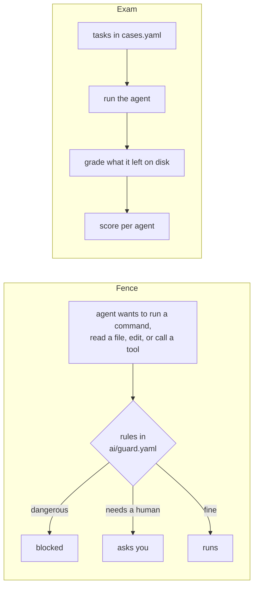

# AI guardrails + evals

Keep AI coding agents safe in your repo, and measure how good they are.
Works with **Claude Code and Codex** from one set of files.

## The problem

You let an AI agent work in your codebase. Two questions come up every time:

1. **Can it do damage?** Read a secret, force-push, delete evidence, post to Jira by mistake.
2. **Is it actually good?** Did the fix work, or did it just say so?

Asking the agent nicely in a prompt does not answer either question.

## The two ideas

**A fence.** A small program runs *before every action* the agent takes.
It reads a list of rules written in plain YAML and says one of three things:
*blocked*, *ask the user first*, or *fine*. The agent cannot talk its way past
it, because it runs outside the model. Think seatbelt.

**An exam.** A list of real tasks with known correct outcomes. A runner gives
each task to the agent, waits, and a grader checks what the agent left on disk:
which files changed, what the diff says, what it answered. Same tasks for every
agent, so you can compare them. Think driving test.



## Try it in five minutes

```bash
git clone https://github.com/mohamedma872/ai-guardrails-evals
cd ai-guardrails-evals
npm install                            # one library + the git hooks

node ai/guard/engine.js --explain      # see the rules in plain words
node ai/guard/engine.js --selftest     # watch the fence block 66 dangerous things (no AI needed)
node ai/evals/run.js                   # the example exams
node ai/evals/run.js coding run --case answer-only --agent claude --dry-run   # what a real run would do
```

Then open `ai/guard.yaml`. Everything the fence does is written there.

## What is in the box

```
ai/guard.yaml       the rules — the file you read and edit
ai/agents.yaml      how to start each agent for an exam (claude, codex)
ai/guard/           the program that applies the rules (you do not need to touch it)
ai/tasks/           one folder per thing you want to measure: the tasks + how to grade them
ai/evals/           the runner and the grader
AGENTS.md           the instructions every agent reads
.claude/ .codex/ .husky/   the wiring, so each agent's hooks call the fence
```

## What the fence stops

- Reading secret files such as `.env`, keys, keystores, MCP configs.
- Writing anything that looks like a token or a private key.
- Force-pushing and rewriting git history.
- Deleting evidence and eval results.
- Editing the rules themselves (asks you).
- Sending things to the outside world: Jira, Slack, Gmail, deploys, publishing (asks you).
- Risky shell commands: `sudo`, `curl | sh`, dropping tables, wiping devices (asks you).

Codex goes through the same file. And for anyone at all, including
humans, the git hooks refuse commits that contain secrets and pushes that
rewrite history.

## Change a rule

Open `ai/guard.yaml`, edit, then check:

```yaml
  - id: sudo
    decision: ask        # deny · ask · off
    description: Runs as root
    regex: '(^|[;&|]\s*)sudo\s'
```

```bash
node ai/guard/engine.js --check
```

No code, no restart.

## Write an exam

Open `ai/tasks/coding/cases.yaml`. A task is four lines: what to ask, which
files may change, what must appear in the result, and where you know that from.

```yaml
- name: add-changelog-entry
  ask: Add a line "Added: AI guardrails and evals kit" under Unreleased in CHANGELOG.md.
  may_change: [CHANGELOG.md]
  diff_must_contain: ["AI guardrails and evals kit"]
  why: "starter — replace with a bug you already fixed"
```

A task that must change nothing is `may_change: []`. A question gets
`answer_must_contain`. A command that must pass afterwards goes under `check`.
Two words that must both appear are written `"word + word"`.

Run it against any agent and compare:

```bash
node ai/evals/run.js coding run --all --agent claude
node ai/evals/run.js coding run --all --agent codex
node ai/evals/run.js coding summary
```

The best tasks are real bugs you already fixed: the runner can undo the fix
for the duration of the run and check that the agent finds it again.

## Bonus: a delivery workflow for Claude Code

`/feature <request>` runs a 13-step process: understand the request, write
acceptance criteria, inspect the repo, get analyses from specialist subagents
(architecture, security, QA, performance, Android, iOS), write a plan, **wait
for your approval**, implement, test, get independent reviews, fix, verify.
Every step leaves a file in `ai/runs/<id>/`, and the fence blocks any edit
before you approve the plan.

## Mobile, backend, frontend — any stack

Nothing in the fence, the exam engine, the git hooks, or the workflow knows
what language your repo is in. They look at tool names, file paths, command
text, and what is left on disk. Use them as they are in a Node API, a Django
service, a React web app, a mobile app.

What *is* stack-specific are the examples, and they are meant to be swapped:

| Piece | In this kit | For your stack |
|---|---|---|
| Specialists (`.claude/agents/`) | mobile-architect, android-expert, ios-expert, backend-expert, frontend-expert, security-reviewer, qa-engineer, performance-reviewer, code-reviewer | keep the ones you need, rename, add your own |
| Rules (`.claude/rules/`) | examples for a React Native app | replace with your conventions |
| Exam tasks (`ai/tasks/coding/cases.yaml`) | three starters | your own fixed bugs and questions |
| `AGENTS.md` "Repo facts" | placeholders | your commands and folder map |

`ai/guard.yaml` already covers secrets, destructive commands, deploys and
publishing for any project; add your own paths to `secret_files` and
`disposable_dirs`.

## Go deeper

`ai/README.md` is the full reference: every rule and its trigger, the exam
formats, how to add a task, how each agent is wired, operations.

MIT · Mohamed Elsdody
