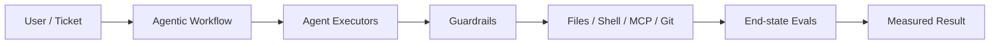
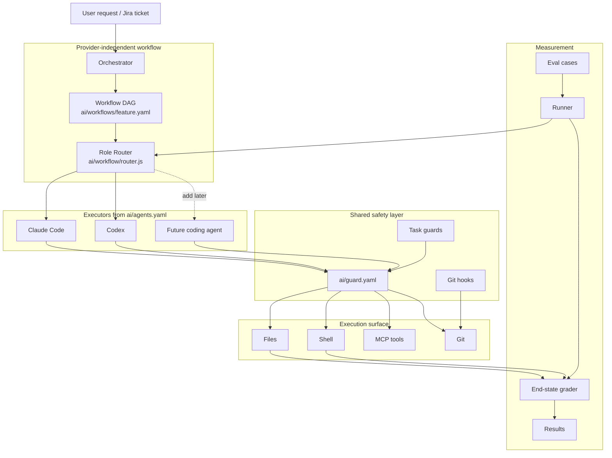
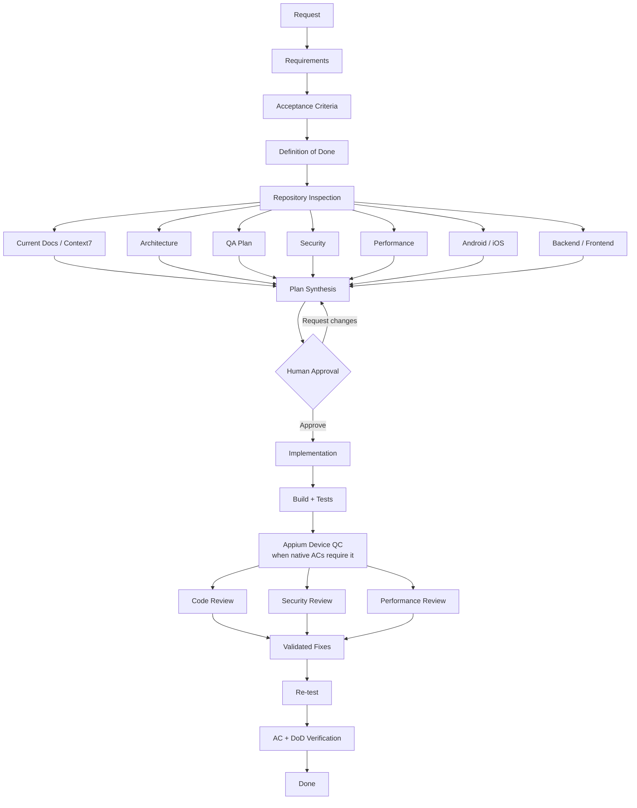
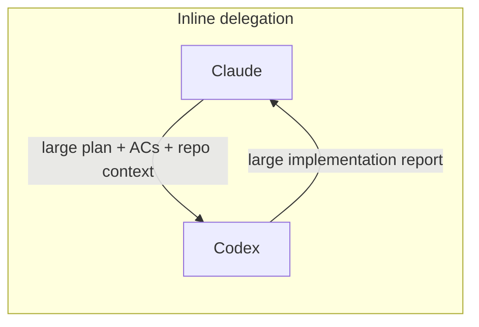
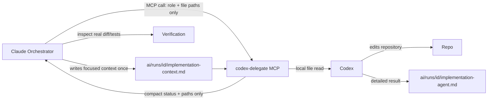
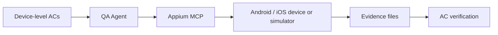
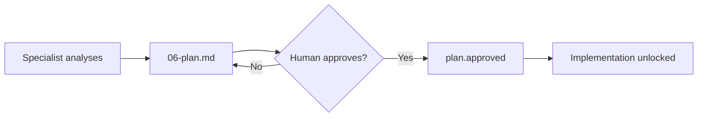

# AI Guardrails + Evals + Agentic Workflow

A practical framework for running coding agents with three things that should not be mixed together:

1. **Agentic workflow** — decides *who does what, in which order*.
2. **Guardrails** — decide *what agents are allowed to do*.
3. **Evals** — verify *what actually happened*.

Works today with **Claude Code + Codex**. Claude can orchestrate a feature, delegate implementation/fixes to Codex through **MCP**, then independently verify the result.

> The model is not the authority. The workflow defines the process, the guardrails control actions, and the evals grade the end state.

---

## Why this exists

Giving an AI coding agent repository access creates three separate problems:

| Problem | Question | This repo |
|---|---|---|
| Safety | Can the agent read secrets, destroy work, bypass hooks, publish, deploy, or write externally? | `ai/guard.yaml` + hooks |
| Delivery | Can work move through requirements, design, approval, implementation, testing and review instead of jumping straight to code? | `ai/workflows/feature.yaml` |
| Quality | Did the agent really solve the task, or did it only say it did? | `ai/evals/` |



---

# Architecture

The core design rule is:

```text
WORKFLOW  !=  AGENT  !=  GUARDRAIL  !=  EVAL
```

Each layer owns one responsibility.



The workflow never needs to know how `claude` or `codex` is launched. Provider commands live in `ai/agents.yaml`; workflow roles live in `ai/workflows/feature.yaml`.

---

# Agentic feature workflow

`/feature <request>` runs a real delivery workflow rather than a single long prompt.



Every phase writes evidence under:

```text
ai/runs/<id>/
```

Typical run:

```text
ai/runs/PROJ-123/
├── 00-request.md
├── 01-requirements.md
├── 02-acceptance-criteria.md
├── 03-definition-of-done.md
├── 04-inspection.md
├── 05-analysis/
│   ├── docs.md
│   ├── architect.md
│   ├── security.md
│   ├── qa.md
│   └── performance.md
├── 06-plan.md
├── plan.approved
├── implementation-context.md
├── implementation-agent.md
├── 07-implementation.md
├── 08-build-test.md
├── device/
│   └── screenshots-and-evidence
├── 09-reviews/
│   ├── code-review.md
│   ├── security.md
│   └── performance.md
├── fixes-context.md
├── fixes-agent.md
├── 10-fixes.md
├── 11-verification.md
└── state.json
```

That folder is the workflow memory, audit trail and verification evidence.

---

# Current documentation with Context7

When behavior depends on an external library/framework API, migration, deprecation, configuration, or SDK version, the workflow can delegate a narrow lookup to `docs-researcher`.

```text
Repository version files
        |
        v
 docs-researcher
        |
        v
    Context7
        |
        v
05-analysis/docs.md
        |
        +--> plan
        +--> Codex implementation context
        +--> reviews
```

The goal is not to paste documentation into the orchestrator context. The docs subagent returns only version-specific facts that affect the task.

Use the reusable `current-docs` skill when a specialist needs this procedure outside `/feature`.

---

# Claude orchestrates — Codex implements through MCP

The default routing intentionally separates planning/review from implementation.

| Role | Default executor | Fallback |
|---|---|---|
| Orchestrator | Claude | — |
| Documentation / architecture / security / QA analysis | Claude | — |
| Android / iOS / backend / frontend analysis | Claude | — |
| Implementation | **Codex** | Claude |
| Code / security / performance review | Claude | — |
| Fixes | **Codex** | Claude |
| Final verification | Claude orchestrator | — |

The mapping lives in `ai/workflows/feature.yaml`.

## Why MCP delegation?

A naive orchestration flow repeatedly copies a large plan into a second-agent prompt, then copies the second agent's long answer back into the orchestrator context.



Instead, this project uses **artifact-based MCP delegation**.



The MCP tool returns only compact metadata such as:

```json
{
  "ok": true,
  "workflow": "feature",
  "role": "implementation",
  "executor": "codex",
  "output_file": "ai/runs/PROJ-123/implementation-agent.md",
  "changed_files": ["src/..."],
  "exit_status": 0
}
```

The full Codex response stays on disk. Claude reads only what it needs to verify the result.

---

# Mobile QA with Appium MCP

Appium is the native mobile automation path for Android/iOS workflow checks.



The workflow keeps Appium role-scoped rather than loading it into every subagent. Android, iOS and `qa-execute` can request it when device evidence is needed.

Use the reusable skill:

```text
.claude/skills/mobile-device-qc/SKILL.md
```

The procedure creates/attaches an isolated Appium session, executes AC-driven flows, saves screenshots/page-source/recording evidence under `ai/runs/<id>/`, and closes the session afterward.

Prefer `NO_UI=true` for agentic Appium runs so heavy Appium UI payloads stay out of model context. The current official Appium MCP server requires Node 22+, so it is kept as an optional role-scoped server while the core repository remains Node 20+.

See `ai/mcp/README.md` for the Appium configuration and recommended tool usage.

---

# Provider-independent role router

`ai/workflow/router.js` joins workflow roles to executor definitions.

Inspect the workflow:

```bash
node ai/workflow/router.js show feature
```

Resolve an executor:

```bash
node ai/workflow/router.js resolve feature implementation --json
```

Execute directly when MCP is not available:

```bash
node ai/workflow/router.js exec feature implementation \
  --agent codex \
  --prompt-file ai/runs/PROJ-123/implementation-context.md \
  --output-file ai/runs/PROJ-123/implementation-agent.md
```

The CLI is the fallback; Claude→Codex delegation should normally use MCP.

---

# Human approval is an enforced gate

The workflow does not let implementation begin simply because an agent believes its own plan is correct.



While a feature run is active and `plan.approved` does not exist:

- product-file edits are denied,
- commits are denied,
- direct shell mutation of `plan.approved` is denied,
- direct shell mutation of `ai/runs/_active` is denied.

Explicit approval:

```bash
node ai/tasks/feature/runs.js approve PROJ-123
```

---

# Shared guardrails under every executor

Claude and Codex use the same repository policy:

```text
ai/guard.yaml
```

The default fence covers secrets, protected workflow/guard files, destructive commands, Git-hook bypass attempts, publishing/deploy actions, configured external MCP writes, and forged workflow approval state.

Codex has no interactive `ask` channel in the configured headless mode, so an `ask` guard decision becomes a denial for Codex.

> These are developer guardrails, not a hostile-code sandbox. For untrusted code or stronger security boundaries, also use a restricted container/VM and enforce policy in CI/server-side controls.

---

# End-state evals: grade reality, not claims

The eval system does not trust an agent's final message. It captures changed files, diff, verification commands, artifacts and the final answer, then grades the end state.

Run the same cases against different executors:

```bash
node ai/evals/run.js coding run --all --agent claude
node ai/evals/run.js coding run --all --agent codex
node ai/evals/run.js coding summary
```

The best eval cases are real bugs/features from your history with known correct outcomes.

---

# Quick start

Requirements for the core framework:

- Node.js **20+**
- Git
- Claude Code and/or Codex CLI for live agent execution

```bash
git clone https://github.com/mohamedma872/ai-guardrails-evals
cd ai-guardrails-evals
npm install
cp .mcp.json.example .mcp.json
```

Validate core configuration:

```bash
npm run guard:check
npm run guard:selftest
npm run workflow:check
npm run workflow:show
```

For Appium device QC, configure the official `appium-mcp` in a Node 22+ MCP environment as described in `ai/mcp/README.md`.

---

# Repository map

```text
.
├── README.md
├── AGENTS.md
├── ai/
│   ├── guard.yaml
│   ├── agents.yaml
│   ├── workflow/router.js
│   ├── workflows/feature.yaml
│   ├── mcp/
│   │   ├── codex-delegate.mjs
│   │   └── README.md
│   ├── tasks/
│   ├── evals/
│   └── runs/
├── .claude/
│   ├── agents/
│   │   └── docs-researcher.md
│   ├── skills/
│   │   ├── current-docs/SKILL.md
│   │   ├── mobile-device-qc/SKILL.md
│   │   └── feature/SKILL.md
│   └── rules/
├── .codex/
├── .husky/
└── .mcp.json.example
```

---

# Design principles

1. Workflow owns sequencing.
2. Roles are not providers.
3. Delegate large cross-agent context through artifacts.
4. Guardrails live outside prompts.
5. Human approval is protected workflow state.
6. Reviews should be independent.
7. Current external APIs should be checked against current docs, not model memory.
8. Native mobile acceptance criteria should produce Appium device evidence when practical.
9. Verify end state rather than trusting polished agent responses.

See `ai/README.md` for the deeper guard/eval reference and `ai/mcp/README.md` for MCP role guidance.

---

MIT · Mohamed Elsdody
