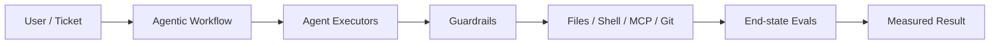
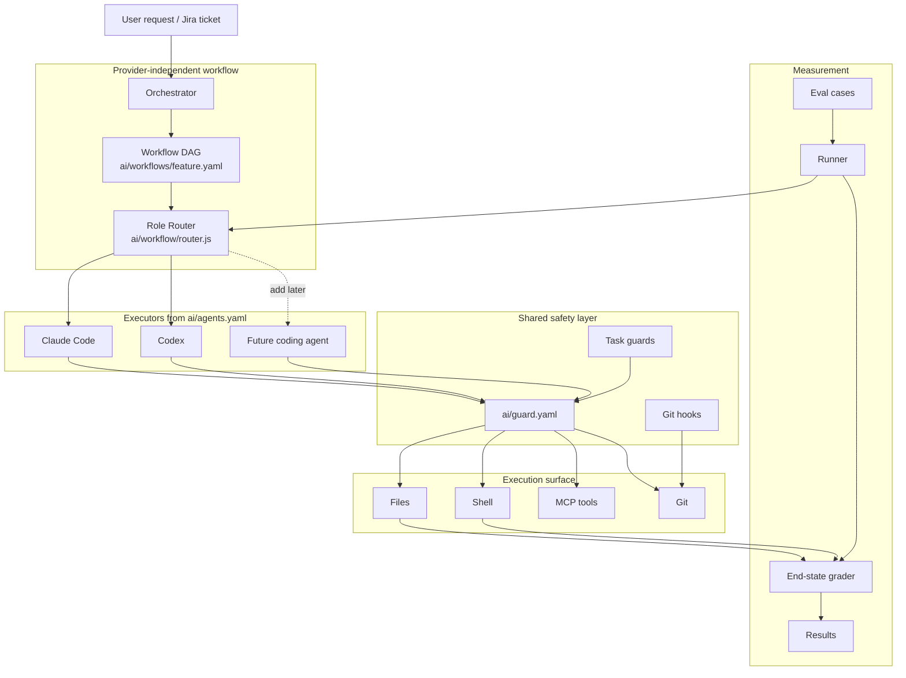
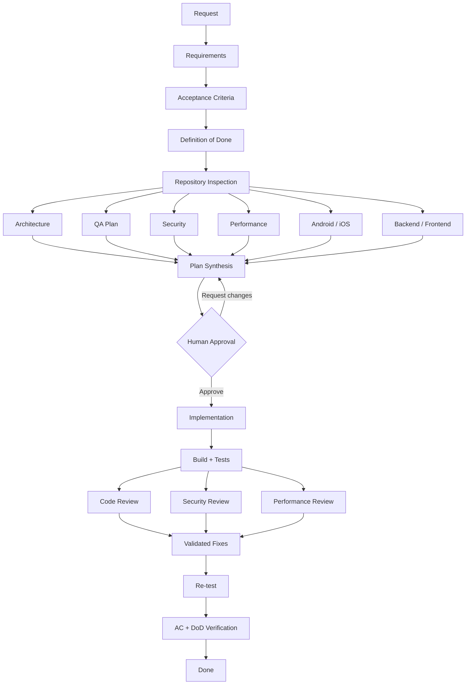
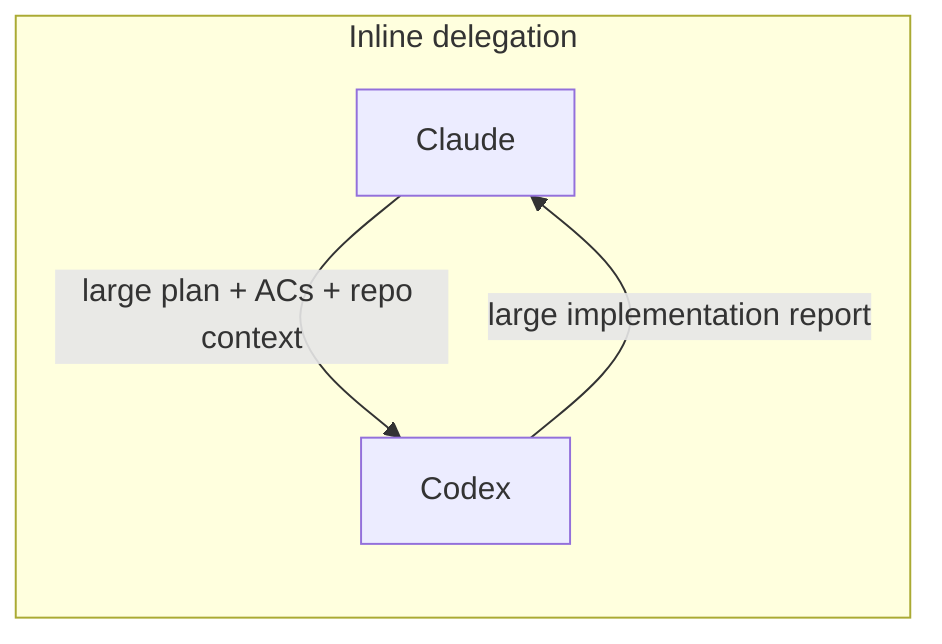
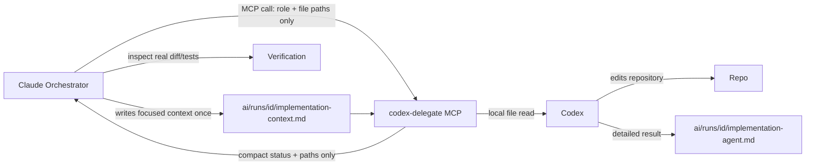
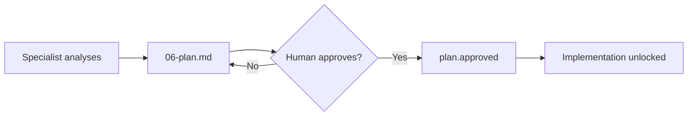
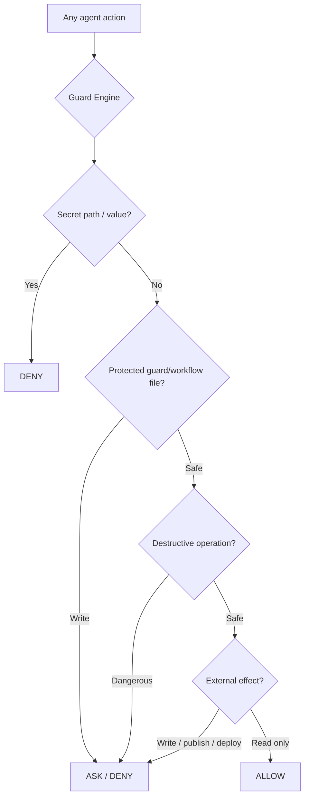
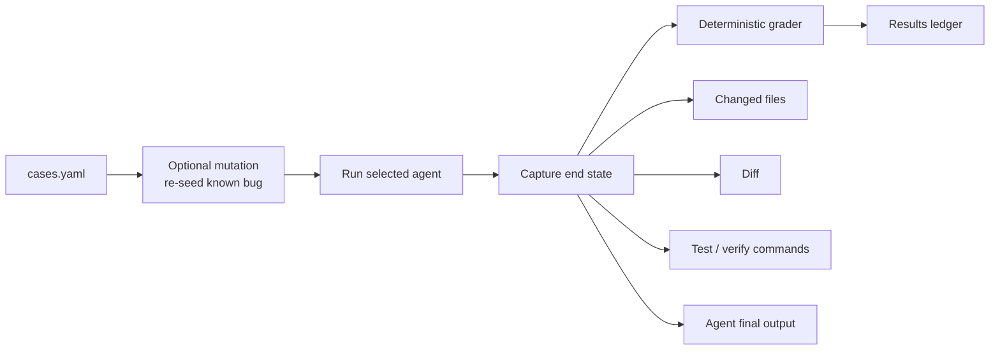

# AI Guardrails + Evals + Agentic Workflow

A practical framework for running coding agents with three things that should not be mixed together:

1. **Agentic workflow** — decides *who does what, in which order*.
2. **Guardrails** — decide *what agents are allowed to do*.
3. **Evals** — verify *what actually happened*.

Works today with **Claude Code + Codex**. Claude can orchestrate a feature, delegate implementation/fixes to Codex through **MCP**, then independently verify the result.

> The model is not the authority. The workflow defines the process, the guardrails control actions, and the evals grade the end state.

---

## Why this exists

Giving an AI coding agent repository access creates three separate problems:

| Problem | Question | This repo |
|---|---|---|
| Safety | Can the agent read secrets, destroy work, bypass hooks, publish, deploy, or write externally? | `ai/guard.yaml` + hooks |
| Delivery | Can work move through requirements, design, approval, implementation, testing and review instead of jumping straight to code? | `ai/workflows/feature.yaml` |
| Quality | Did the agent really solve the task, or did it only say it did? | `ai/evals/` |



---

# Architecture

The core design rule is:

```text
WORKFLOW  !=  AGENT  !=  GUARDRAIL  !=  EVAL
```

Each layer owns one responsibility.



The workflow never needs to know how `claude` or `codex` is launched. Provider commands live in `ai/agents.yaml`; workflow roles live in `ai/workflows/feature.yaml`.

---

# Agentic feature workflow

`/feature <request>` runs a real delivery workflow rather than a single long prompt.



Every phase writes evidence under:

```text
ai/runs/<id>/
```

Typical run:

```text
ai/runs/PROJ-123/
├── 00-request.md
├── 01-requirements.md
├── 02-acceptance-criteria.md
├── 03-definition-of-done.md
├── 04-inspection.md
├── 05-analysis/
│   ├── architect.md
│   ├── security.md
│   ├── qa.md
│   └── performance.md
├── 06-plan.md
├── plan.approved
├── implementation-context.md
├── implementation-agent.md
├── 07-implementation.md
├── 08-build-test.md
├── 09-reviews/
│   ├── code-review.md
│   ├── security.md
│   └── performance.md
├── fixes-context.md
├── fixes-agent.md
├── 10-fixes.md
├── 11-verification.md
└── state.json
```

That folder is the workflow memory, audit trail and verification evidence.

---

# Claude orchestrates — Codex implements through MCP

The default routing intentionally separates planning/review from implementation.

| Role | Default executor | Fallback |
|---|---|---|
| Orchestrator | Claude | — |
| Architecture / security / QA analysis | Claude | — |
| Android / iOS / backend / frontend analysis | Claude | — |
| Implementation | **Codex** | Claude |
| Code / security / performance review | Claude | — |
| Fixes | **Codex** | Claude |
| Final verification | Claude orchestrator | — |

The mapping lives in `ai/workflows/feature.yaml`.

## Why MCP delegation?

A naive orchestration flow repeatedly copies a large plan into a second-agent prompt, then copies the second agent's long answer back into the orchestrator context.



Instead, this project uses **artifact-based MCP delegation**.



The MCP tool returns only compact metadata such as:

```json
{
  "ok": true,
  "workflow": "feature",
  "role": "implementation",
  "executor": "codex",
  "output_file": "ai/runs/PROJ-123/implementation-agent.md",
  "changed_files": ["src/..."],
  "exit_status": 0
}
```

The full Codex response stays on disk. Claude reads only what it needs to verify the result.

### MCP tool

The local server is:

```text
ai/mcp/codex-delegate.mjs
```

It exposes:

```text
mcp__codex-delegate__delegate
```

The tool accepts a workflow role and two run-artifact paths:

```text
workflow=feature
role=implementation
prompt_file=ai/runs/PROJ-123/implementation-context.md
output_file=ai/runs/PROJ-123/implementation-agent.md
```

For safety, the MCP server only accepts prompt/output files under `ai/runs/`.

---

# Provider-independent role router

`ai/workflow/router.js` joins workflow roles to executor definitions.

Inspect the workflow:

```bash
node ai/workflow/router.js show feature
```

Resolve an executor:

```bash
node ai/workflow/router.js resolve feature implementation --json
```

Example result:

```json
{
  "workflow": "feature",
  "role": "implementation",
  "executor": "codex",
  "candidates": ["codex", "claude"],
  "read_only": false
}
```

Execute directly when MCP is not available:

```bash
node ai/workflow/router.js exec feature implementation \
  --agent codex \
  --prompt-file ai/runs/PROJ-123/implementation-context.md \
  --output-file ai/runs/PROJ-123/implementation-agent.md
```

The CLI is the fallback; Claude→Codex delegation should normally use MCP.

---

# Human approval is an enforced gate

The workflow does not let implementation begin simply because an agent believes its own plan is correct.



While a feature run is active and `plan.approved` does not exist:

- product-file edits are denied,
- commits are denied,
- direct shell mutation of `plan.approved` is denied,
- direct shell mutation of `ai/runs/_active` is denied.

Explicit approval:

```bash
node ai/tasks/feature/runs.js approve PROJ-123
```

---

# Shared guardrails under every executor

Claude and Codex use the same repository policy:

```text
ai/guard.yaml
```



The default fence covers:

- `.env`, private keys, keystores, service-account files and MCP credentials,
- token-shaped data written into files, commits or outbound tool payloads,
- force-pushes,
- agent attempts to bypass hooks with `--no-verify`, `HUSKY=0`, or disabled hook paths,
- recursive destructive deletes outside build/cache folders,
- `sudo`, `curl | sh`, destructive database/container/device operations,
- publishing, deployment and infrastructure-changing commands,
- writes to configured external MCP services,
- edits to guard files, workflow definitions, routing, hooks and agent wiring,
- forged workflow approval state.

Codex has no interactive `ask` channel in the configured headless mode, so an `ask` guard decision becomes a denial for Codex.

> These are developer guardrails, not a hostile-code sandbox. For untrusted code or stronger security boundaries, also use a restricted container/VM and enforce policy in CI/server-side controls.

---

# End-state evals: grade reality, not claims

The eval system does not trust an agent's final message.



The grader can check:

- which files changed,
- whether changes stayed inside allowed files,
- required diff/output signatures,
- forbidden patterns,
- required artifacts,
- verification commands,
- completion status,
- cost and duration where the provider exposes them.

Run the same cases against different executors:

```bash
node ai/evals/run.js coding run --all --agent claude
node ai/evals/run.js coding run --all --agent codex
node ai/evals/run.js coding summary
```

The best eval cases are real bugs/features from your history with known correct outcomes.

---

# Quick start

Requirements:

- Node.js **20+**
- Git
- Claude Code and/or Codex CLI for live agent execution

```bash
git clone https://github.com/mohamedma872/ai-guardrails-evals
cd ai-guardrails-evals
npm install
```

Validate everything that does not require a live model:

```bash
npm run guard:check
npm run guard:selftest
npm run workflow:check
npm run workflow:show
node ai/evals/run.js
```

Inspect guardrails:

```bash
npm run guard:explain
```

Dry-run an eval:

```bash
node ai/evals/run.js coding run --case answer-only --agent claude --dry-run
node ai/evals/run.js coding run --case answer-only --agent codex --dry-run
```

---

# Enable Claude → Codex MCP delegation

Copy the example MCP configuration:

```bash
cp .mcp.json.example .mcp.json
```

The important project-local entry is:

```json
{
  "mcpServers": {
    "codex-delegate": {
      "command": "node",
      "args": ["ai/mcp/codex-delegate.mjs"]
    }
  }
}
```

`npm install` provides the MCP server SDK. The local server uses stdio; Claude launches it as an MCP server and can call `codex-delegate/delegate` when `/feature` routes a role to Codex.

Do **not** put real secrets into `.mcp.json`; it is intentionally treated as a secret file by the guard and ignored by Git.

---

# Repository map

```text
.
├── README.md
├── AGENTS.md
├── CLAUDE.md
├── ai/
│   ├── guard.yaml                 # shared safety policy
│   ├── agents.yaml                # executor launch definitions
│   │
│   ├── workflow/
│   │   └── router.js              # role → executor router
│   │
│   ├── workflows/
│   │   └── feature.yaml           # provider-independent workflow DAG
│   │
│   ├── mcp/
│   │   └── codex-delegate.mjs     # Claude → Codex artifact-based delegation
│   │
│   ├── guard/
│   │   ├── engine.js
│   │   ├── git-pre-commit.js
│   │   ├── git-pre-push.js
│   │   └── rules.js
│   │
│   ├── tasks/
│   │   ├── _template/
│   │   ├── coding/
│   │   └── feature/
│   │       ├── guard.js           # plan gate
│   │       └── runs.js            # resumable workflow state
│   │
│   ├── evals/
│   │   ├── run.js
│   │   └── grade.js
│   │
│   └── runs/                      # ignored runtime workflow evidence
│
├── .claude/
│   ├── agents/                    # Claude specialist implementations
│   ├── skills/feature/SKILL.md    # Claude orchestrator instructions
│   └── settings.json              # Claude hook wiring
│
├── .codex/
│   └── hooks.json                 # Codex guard wiring
│
├── .husky/
│   ├── pre-commit
│   └── pre-push
│
└── .mcp.json.example              # local MCP configuration example
```

---

# Change workflow routing

Want Claude to implement instead of Codex?

```yaml
# ai/workflows/feature.yaml
roles:
  implementation:
    executor: claude
```

Want Codex for a different role?

```yaml
roles:
  backend:
    executor: codex
    fallback: [claude]
```

Validate after editing:

```bash
npm run workflow:check
```

---

# Add another coding agent

The workflow should not change just because the provider changes.

Add an executor to `ai/agents.yaml`:

```yaml
my-agent:
  label: My Coding Agent
  command: [my-agent, run, "{prompt}"]
  result:
    file: "{last_message_file}"
```

Then route a role to it:

```yaml
roles:
  implementation:
    executor: my-agent
    fallback: [codex, claude]
```

The new agent should also have equivalent guardrail wiring before being trusted for live mutation.

---

# Create your own eval task

Copy the template:

```bash
cp -R ai/tasks/_template ai/tasks/my-task
```

A task normally contains:

```text
TASK.md
cases.yaml
adapter.js
guard.yaml
guard.js          # only when stateful/custom checks are needed
```

Example coding case:

```yaml
- name: add-changelog-entry
  ask: Add "Added: agentic workflow" under Unreleased in CHANGELOG.md.
  may_change: [CHANGELOG.md]
  diff_must_contain: ["agentic workflow"]
  check:
    - node ai/guard/engine.js --check
  why: known expected repository change
```

Self-check a case before trusting it:

```bash
node ai/evals/grade.js my-task add-changelog-entry --oracle --no-write
node ai/evals/grade.js my-task add-changelog-entry --null --no-write
```

---

# Design principles

### 1. Workflow owns sequencing

The agent does not decide that testing or review can be skipped.

### 2. Roles are not providers

`implementation` is a role. Codex is one possible executor for that role.

### 3. Delegate through artifacts

Large cross-agent context belongs in files under `ai/runs/`; MCP calls should pass references, not duplicate full documents.

### 4. Guardrails live outside prompts

A prompt saying "do not read `.env`" is weaker than a hook that blocks the read.

### 5. Human approval is state

The approval gate is represented by a protected workflow marker, not an agent's interpretation of a sentence.

### 6. Reviews should be independent

The implementation agent's self-review is not the independent review.

### 7. Verify end state

A polished final response is not proof of correctness.

---

# Current maturity

This repository is designed as a transparent developer workflow and evaluation kit. It is deliberately small enough to inspect.

Important next hardening areas for production/security-sensitive environments include stronger process/network isolation, CI/server-side enforcement, hidden holdout eval datasets, broader adversarial guard regression tests, and fail-closed execution modes.

See `ai/README.md` for the deeper reference on rule formats, task adapters, grading and operations.

---

MIT · Mohamed Elsdody
