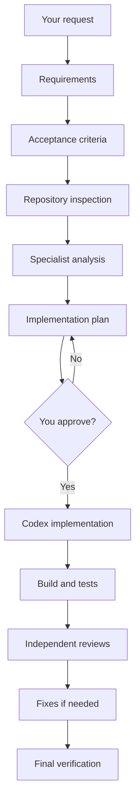
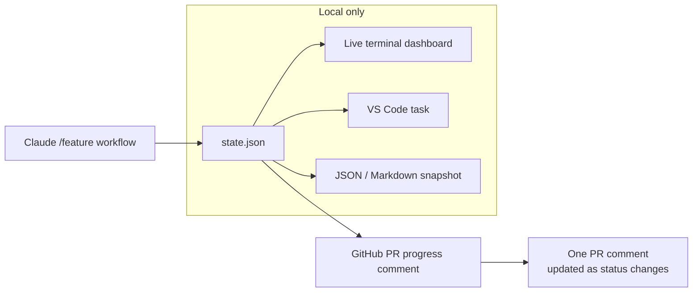
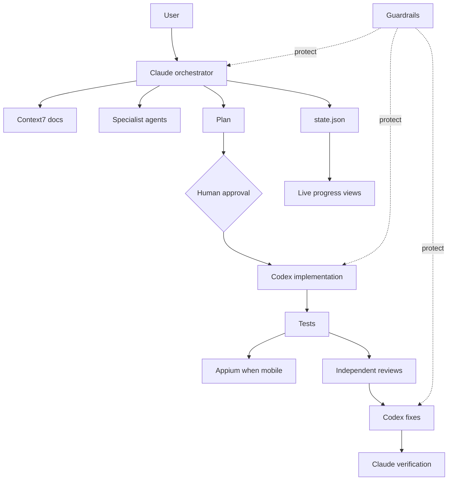

# AI Agent Workflow Kit

A practical workflow for using **Claude Code + Codex** on real software tasks without letting agents jump straight into code.

The basic idea:

```text
You ask for a feature
        ↓
Claude understands and plans it
        ↓
Specialist agents analyze it
        ↓
You approve the plan
        ↓
Codex implements it
        ↓
Tests + reviews verify it
        ↓
Claude gives you the final result
```

At the same time, **guardrails** protect the repository and **evals** check whether the agents actually did the job correctly.

---

## What this project gives you

| Capability | What it means |
|---|---|
| **Agentic workflow** | Requirements → analysis → plan → approval → implementation → tests → reviews → verification. |
| **Live progress** | Watch the active workflow in the terminal, VS Code, JSON, or an updating GitHub PR comment. |
| **Claude + Codex delegation** | Claude coordinates the work. Codex handles implementation and fixes by default. |
| **Guardrails** | Agents are blocked from dangerous actions such as reading secrets, force-pushing, bypassing hooks, or editing protected workflow files. |
| **Current documentation** | Context7 gives agents current library/framework documentation instead of relying only on model memory. |
| **Mobile QA** | Appium can verify Android/iOS acceptance criteria on an emulator, simulator, or device. |
| **Evals** | Tasks are graded from the final repository state, not from what the agent claims it did. |

---

# The main workflow

Use:

```text
/feature <your request>
```

Example:

```text
/feature Add biometric login with password fallback
```

The workflow follows this path:



The important part is the **human approval gate**:

> No product-code implementation should start until you approve the plan.

---

# Live workflow progress

The workflow already stores progress in:

```text
ai/runs/<run-id>/state.json
```

That file remains the single source of truth. The progress layer only **renders** it; it does not create a separate workflow state.

## How the visualization works



`ai/runs/` stays gitignored. Prompts, detailed agent output, test evidence, and local artifacts are **not published to GitHub** by the progress feature.

Only a safe status summary can be sent to the PR.

## Terminal dashboard

Run once:

```bash
npm run workflow:progress
```

Watch it live:

```bash
npm run workflow:progress:watch
```

Example:

```text
╭────────────────────────────────────────────────────────────╮
│  FEATURE: PAYMENTS-123                        46%           │
╰────────────────────────────────────────────────────────────╯
   █████████████░░░░░░░░░░░░░░░  46%

 ✅ Request                  pass
 ✅ Requirements             pass
 ✅ Acceptance Criteria      pass
 ✅ Definition of Done       pass
 ✅ Repository Inspection    pass
 🔄 Specialist Analysis      in_progress
      ✅ docs                pass · claude
      ✅ architect           pass · claude
      ✅ qa-plan             pass · claude
      🔄 security            in_progress · claude
      ✅ performance         pass · claude
      ⏳ android             pending · claude
      ⏭ ios                 skipped · claude
 ⏳ Implementation Plan      pending
 🔒 Human Approval           pending
 ⏳ Implementation           pending
 ⏳ Build + Tests            pending
 ⏳ Independent Reviews      pending
 ⏳ Validated Fixes          pending
 ⏳ Final Verification       pending

 Current: Specialist Analysis → security
 Plan gate: 🔒 waiting for human approval
```

The dashboard understands both **phase status** and individual parallel **role status**, so `analysis` and `reviews` do not appear as one opaque step.

## VS Code / editor view

This repo includes `.vscode/tasks.json`.

In VS Code:

```text
Command Palette
→ Tasks: Run Task
→ AI Workflow: Live Progress
```

This opens a dedicated terminal panel that refreshes while the agents work.

Available tasks:

- `AI Workflow: Live Progress`
- `AI Workflow: Progress Snapshot`
- `AI Workflow: Live GitHub PR Progress`
- `AI Workflow: Update GitHub PR Progress Once`

This also works in editors that understand VS Code-compatible task definitions.

## JSON output

For another UI, script, extension, or dashboard:

```bash
npm run workflow:progress:json
```

This produces machine-readable workflow state without exposing the full run artifacts.

## GitHub PR progress

You can surface the same workflow directly on the feature PR.

One update:

```bash
npm run workflow:progress:github
```

Keep the PR comment synchronized while the workflow runs:

```bash
npm run workflow:progress:github:watch
```

The command maintains **one comment** and edits it when progress changes instead of adding a new comment every time.

Example PR view:

```text
🤖 Agentic Workflow Progress

Run: PAYMENTS-123
██████████░░░░░░░░░░ 52%

✅ Requirements
✅ Acceptance Criteria
✅ Repository Inspection
🔄 Specialist Analysis
   ✅ Architecture
   ✅ QA
   🔄 Security
   ⏳ Android

⏳ Plan
🔒 Human Approval
⏳ Codex Implementation
⏳ Build + Tests
⏳ Reviews
⏳ Final Verification
```

Requirements for PR publishing:

```bash
gh auth login
```

and the current branch must have a GitHub pull request. You can also pass a PR explicitly:

```bash
node ai/workflow/github-progress.js --pr 123 --watch
```

## Progress states

```text
✅ pass
🔄 in_progress
⏳ pending
🔒 human approval pending
⛔ blocked
❌ fail
⏭ skipped
```

---

# Who does what?

| Role | Responsibility |
|---|---|
| **Claude** | Orchestrates the workflow, requirements, analysis, planning, reviews, and final verification. |
| **Codex** | Implements the approved plan and fixes validated review findings by default. |
| **Specialists** | Focused architecture, security, QA, performance, Android, iOS, backend, frontend, and code-review analysis. |
| **Human** | Approves the implementation plan before product code can be changed. |

Claude does not need to do all coding itself. Implementation and fixes can be delegated through the local `codex-delegate` MCP server.

Large context stays in:

```text
ai/runs/<run-id>/
```

instead of being copied repeatedly between agents.

---

# Current documentation with Context7

For version-sensitive questions, the workflow can use **Context7** so agents do not depend only on model memory.

```text
Repository dependency/version
        ↓
Docs researcher
        ↓
Context7
        ↓
Short current-doc decision
        ↓
Plan / implementation / review
```

Useful for framework upgrades, deprecated APIs, SDK setup, migrations, build settings, and changing APIs.

---

# Mobile QA with Appium

For native mobile tasks, Appium can verify Android and iOS behavior.

```text
Acceptance criteria
        ↓
QA agent
        ↓
Appium
        ↓
Android / iOS device
        ↓
Evidence
        ↓
PASS / FAIL / BLOCKED
```

Typical checks include permissions, biometrics, RTL, deep links, WebViews, lifecycle behavior, gestures, and scrolling.

---

# What is MCP here?

Think of MCP as a **bridge between an AI agent and another capability**.

| MCP | Purpose |
|---|---|
| **codex-delegate** | Claude hands implementation/fix work to Codex |
| **Context7** | Current framework/library documentation |
| **Atlassian** | Jira and Confluence context |
| **Appium** | Android/iOS device testing |
| **Playwright** | Optional browser testing |
| **GitHub** | Optional PR/CI/repository context |

Each role should only get the tools it needs.

More detail: [`ai/mcp/README.md`](ai/mcp/README.md)

---

# Guardrails

The agents run behind the shared policy in:

```text
ai/guard.yaml
```

It protects against things such as:

- reading secret files;
- leaking credentials;
- force-pushing;
- bypassing Git hooks;
- destructive shell commands;
- unexpected publishing/deployment;
- modifying guard/workflow files to make a task pass;
- implementation before human approval.

Inspect active rules with:

```bash
npm run guard:explain
```

---

# Evals

Evals answer:

> Did the agent actually solve the task?

They check the real end state: files, diffs, tests, required artifacts, forbidden changes, and completion evidence.

Fast/free health check:

```bash
npm run exam:check
```

Live comparison:

```bash
node ai/evals/auto.js live --tasks coding
```

More detail: [`ai/README.md`](ai/README.md)

---

# Quick start

```bash
git clone https://github.com/mohamedma872/ai-agent-workflow-kit
cd ai-agent-workflow-kit
npm install
cp .mcp.json.example .mcp.json
```

Validate:

```bash
npm run guard:check
npm run guard:selftest
npm run workflow:check
npm run exam:check
```

Inspect the workflow:

```bash
npm run workflow:show
```

Start the progress view:

```bash
npm run workflow:progress:watch
```

Then use Claude Code:

```text
/feature <request>
```

---

# Important files

| File | Why it matters |
|---|---|
| `README.md` | High-level explanation and progress visualization |
| `ai/workflows/feature.yaml` | Workflow stages and role routing |
| `ai/workflow/progress.js` | Terminal / JSON / Markdown progress renderer |
| `ai/workflow/github-progress.js` | Safe single-comment GitHub PR progress publisher |
| `ai/tasks/feature/runs.js` | Local phase and per-role state store |
| `.vscode/tasks.json` | Editor tasks for live progress |
| `ai/agents.yaml` | Claude/Codex launch definitions |
| `ai/guard.yaml` | Safety rules |
| `.claude/skills/feature/SKILL.md` | Claude orchestration procedure |
| `ai/mcp/README.md` | MCP/tool setup |
| `ai/README.md` | Advanced guardrail/eval reference |

---

# Architecture



---

## Advanced details

- [`ai/README.md`](ai/README.md) — guard engine, eval framework, exam automation and operations.
- [`ai/mcp/README.md`](ai/mcp/README.md) — Context7, Atlassian, Codex delegation, GitHub, Playwright and Appium setup.
- [`AGENTS.md`](AGENTS.md) — rules every coding agent must follow.
- [`.claude/skills/feature/SKILL.md`](.claude/skills/feature/SKILL.md) — detailed `/feature` orchestration flow.

---

MIT · Mohamed Elsdody
