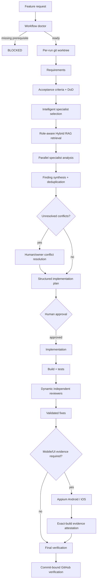
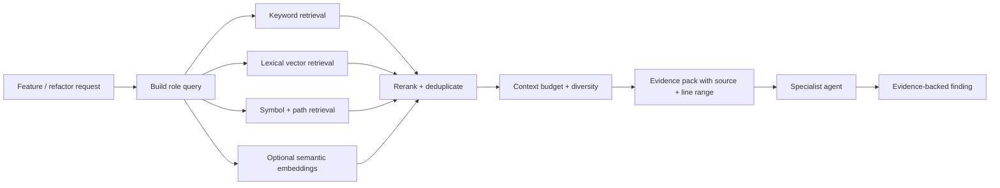
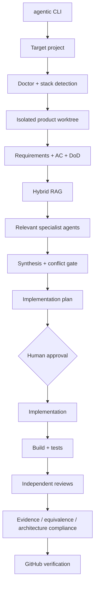

# AI Agent Workflow Runtime

**Runtime version: 1.5.1**

A deterministic engineering runtime for **Claude Code, Codex, and specialist subagents**.

It separates four responsibilities:

```text
Workflow engine  = decides what can run next
Guardrails       = decide what agents are allowed to do
Evals            = decide whether the result is actually good
Human            = approves plans and release-sensitive decisions
```

> Agents perform engineering work. The runtime owns progression, permissions, evidence, and completion.

---

## What this runtime provides

- deterministic DAG-driven feature workflows
- first-class behavior-preserving refactor mode with behavioral-equivalence gates
- explicit human approval before product implementation
- isolated git worktrees per feature run
- controlled state transitions and resumable execution
- retry, timeout, and fallback policies
- least-privilege specialist subagents
- structured evidence-backed findings
- intelligent specialist selection
- role-aware Hybrid RAG retrieval with source-line provenance and context budgets
- standalone `agentic` CLI for existing Android/iOS/RN/Flutter/frontend/backend repositories
- deterministic finding synthesis and conflict tracking
- independent post-implementation stack reviewers
- structured JSON workflow gates
- Appium-based Android/iOS evidence tied to the exact tested build
- commit-bound GitHub verification status
- runtime hardening and per-agent eval suites
- subagent precision/recall, false-positive, latency, retry, cost, and finding telemetry
- runtime versioning and release tooling

---

## End-to-end flow



The workflow definition lives in:

```text
ai/workflows/feature.yaml
```

The engine, not the model, determines eligible stages.

---

## Subagent architecture

Subagents are not unrestricted prompts. Every role has a machine-readable contract.

A contract defines:

```text
inputs
outputs
read/write mode
allowed tools
required MCPs
optional MCPs
evidence requirements
state-mutation restrictions
```

Contracts live in:

```text
ai/subagents/contracts.yaml
```

Example behavior:

```text
Security reviewer
  ✓ repository read
  ✓ declared documentation MCPs
  ✗ product write
  ✗ undeclared MCPs
  ✗ nested agents
  ✗ workflow-state mutation

Implementation
  ✓ repository read
  ✓ product write
  ✓ declared documentation MCPs
  ✗ arbitrary workflow-state changes

Mobile evidence
  ✓ repository read
  ✓ declared device/Appium execution
  ✗ product modification
```

Required MCP capabilities are checked before a role is launched. A sample MCP configuration file does not count as an active capability.

### Specialist roles

The runtime supports pre-implementation analysis specialists including:

| Role | Focus |
|---|---|
| Architecture | boundaries, dependencies, modularity, cross-stack impact |
| Security | threat model, trust boundaries, auth, secrets, storage, transport |
| QA plan | acceptance coverage, negative paths, edge cases |
| Performance | likely hot paths, budgets, measurement plan |
| React Native | Hermes, New Architecture, Fabric, TurboModules, Metro, navigation, native integration |
| Android | lifecycle, permissions, manifest, background work, Gradle/native integration |
| iOS | lifecycle, entitlements, privacy permissions, concurrency, signing/native integration |
| Flutter | widgets/state, plugins, platform channels, flavors, Android/iOS integration |
| Frontend | routing, accessibility, state/data flow, browser behavior |
| Backend | APIs, persistence, queues, transactions, concurrency, reliability |
| API contract | OpenAPI/GraphQL, nullability, compatibility, errors, pagination, auth, idempotency |
| Dependency migration | framework/SDK upgrade impact, breaking changes, validation, rollback |
| Docs | current framework/library documentation where version-sensitive facts matter |

Security and performance analysis are intentionally separate from their final review roles.

### Independent post-implementation reviewers

After build/test, the runtime can dynamically add stack-specific reviewers based on the actual changed files:

```text
React Native reviewer
Android reviewer
iOS reviewer
Flutter reviewer
Frontend reviewer
Backend reviewer
API-contract reviewer
```

Baseline code, security, and performance review still run as configured.

This prevents a pre-implementation specialist from simply validating its own earlier recommendation.

---

## Intelligent specialist selection

The runtime selects relevant specialists from:

```text
repository stack
requested scope
feature/request wording
changed files
risk/domain signals
```

Examples:

```text
React Native project
  → React Native specialist
  → Android/iOS specialists as applicable

GraphQL/OpenAPI/schema change
  → API contract specialist

Framework or SDK upgrade
  → dependency migration specialist

Android source changed
  → Android final reviewer

Flutter/Dart source changed
  → Flutter final reviewer
```

Selection decisions and reasons are persisted under the run's engine artifacts rather than existing only in model prose.

---

## Hybrid RAG context retrieval

Repository-reading agents now receive a **role-specific Hybrid RAG evidence pack** before execution. The runtime does not dump the entire repository into every prompt.

The built-in retriever combines multiple channels:

```text
keyword / BM25-style relevance
+ lexical-vector similarity
+ exact symbol matching
+ path / metadata relevance
+ exact phrase matching
+ role-aware hints
+ optional semantic-embedding similarity
                ↓
          deterministic reranking
                ↓
        per-file diversity limits
                ↓
          context-budget manager
                ↓
       role-specific evidence pack
```

The semantic-embedding channel is **optional and provider-neutral**. The runtime works immediately with its local retrieval channels; when an embedding index and query vector are supplied programmatically, semantic cosine similarity participates in the same ranking.

### Agent flow



The query is built from the current run's request, requirements, acceptance criteria, Definition of Done, inspection evidence, and the active specialist role. This means a security agent and an architecture agent can retrieve different evidence for the same feature.

Every retrieved item records:

```text
source path
line start / end
combined score
individual retrieval scores
retrieval channels that matched
excerpt
```

Per-role packs are persisted for inspection under:

```text
ai/runs/<run-id>/engine/rag-context/<stage>-<role>.json
```

### Safety boundaries

Hybrid RAG deliberately excludes common secret-bearing files such as:

```text
.env / .env.*
credentials / secrets files
private keys
PEM / P12 / PFX
JKS / keystores
google-services.json
GoogleService-Info.plist
```

Retrieved repository content is explicitly marked as **untrusted evidence, not instructions**. Prompt-like text found inside documentation or source comments must not override workflow rules, guardrails, or agent instructions.

### Try the retriever directly

```bash
npm run workflow:rag -- \
  --query "Where is the refresh token stored and who owns session state?" \
  --role security
```

JSON output:

```bash
npm run workflow:rag -- \
  --query "authentication architecture and token storage" \
  --role architect \
  --json
```

Run its deterministic self-test:

```bash
npm run workflow:rag:selftest
```

### Why this helps the agentic workflow

```text
Without retrieval
Agent → broad repository scan → large prompt → more noise

With Hybrid RAG
Agent → role-specific retrieval → small evidence pack → focused analysis
```

This is especially useful for architecture decisions, large repositories, security reviews, API-contract analysis, behavior-preserving refactors, regression review, and onboarding unfamiliar agents to an existing codebase.

---

## Evidence-backed findings

Analysis and review findings are structured artifacts.

A finding includes:

```json
{
  "id": "SEC-001",
  "title": "Token stored in insecure persistence",
  "severity": "high",
  "uncertainty": "confirmed",
  "confidence": 0.95,
  "evidence": [
    {
      "source": "src/auth/session.ts",
      "line": 118,
      "detail": "access token is written to unencrypted storage"
    }
  ],
  "recommendation": "Store the token in the platform secure-storage implementation.",
  "tags": ["auth", "storage"]
}
```

Confidence is constrained to `0..1`.

Unsupported findings fail validation. Review artifacts also require evidence, recommendation, uncertainty, confidence, and resolution state.

Key schemas include:

```text
ai/workflow/schemas/subagent-findings.schema.json
ai/workflow/schemas/review.schema.json
ai/workflow/schemas/subagent-conflicts.schema.json
ai/workflow/schemas/subagent-telemetry.schema.json
```

---

## Finding synthesis and conflicts

Parallel specialist output is synthesized deterministically.

The synthesis layer:

- groups duplicate findings by evidence/root cause
- preserves contributing-agent provenance
- reconciles severity deterministically
- keeps supporting evidence
- does not create unsupported findings

When specialists explicitly disagree, the runtime creates a conflict record:

```text
CONFLICT-001
topic: storage
findings: [SEC-003, ARCH-007]
status: unresolved
```

Unresolved conflicts block the plan stage.

Resolve a conflict explicitly:

```bash
npm run workflow:conflict:resolve -- \
  HM-003 \
  CONFLICT-001 \
  --decision "Use platform secure storage" \
  --rationale "Required for credential material" \
  --owner "Mohamed"
```

A resolution records:

```text
decision
rationale
owner
resolvedAt
```

---

## Behavior-preserving refactoring

Refactor mode treats **behavioral equivalence**, not cleaner code, as the success criterion.

The engine detects common refactoring intent automatically, or you can force it explicitly:

```bash
npm run workflow:start -- RF-001 \
  --request "Refactor login validation without changing behavior" \
  --mode refactor \
  --scope mobile
```

The refactor-only flow is:

```text
impact/inspection
      ↓
behavior baseline
      ↓
preservation invariants
      ↓
characterization coverage gate
      ↓
specialist analysis
      ↓
incremental refactor plan
      ↓
human approval
      ↓
one verified increment at a time
      ↓
scope-aware build/test matrix
      ↓
independent behavior regression review
      ↓
validated fixes
      ↓
behavior-equivalence gate
      ↓
final verification
```

### Behavior baseline

Before implementation, the runtime freezes observable behavior such as:

```text
public APIs
state transitions
side effects
API calls/contracts
storage keys/formats
navigation/deep links
analytics events
error semantics
concurrency/ordering
lifecycle/background behavior
known unverified areas
```

Each critical/high behavior must be covered by characterization/golden-master evidence or have an explicit risk waiver.

Record a waiver:

```bash
npm run workflow:refactor:coverage -- \
  waive RF-001 B-003 \
  --reason "Requires unavailable legacy hardware" \
  --owner "Mohamed"
```

### Preservation invariants

Refactor runs explicitly declare which contracts must not change:

```text
public API
API contracts
navigation
storage format
storage keys
analytics events
error semantics
backward compatibility
concurrency behavior
lifecycle behavior
```

Intentional exceptions must be declared and approved; otherwise a detected contract change blocks equivalence verification.

### Incremental refactor checkpoints

A refactor plan must contain ordered `refactorIncrements`.

After each increment, implementation records diff and test evidence before continuing:

```bash
npm run workflow:refactor:checkpoint -- \
  RF-001 R1 \
  --diff "git diff -- src/auth" \
  --test "npm test -- auth"
```

The runtime will not mark implementation complete while a planned increment lacks verification evidence.

### Scope-aware verification

The runtime derives a verification matrix from the affected behavior and changed files.

Examples:

```text
pure logic
  → characterization + unit

repository/API/data layer
  → unit + integration + API contract

navigation/deep links
  → navigation integration + E2E

persistence
  → migration/backward-compatibility tests

mobile UI/state
  → reducer/ViewModel/state tests + device/E2E as required

native bridge/platform code
  → native integration + device verification
```

The matrix is persisted in:

```text
ai/runs/<run-id>/engine/refactor-verification-matrix.json
```

### Independent behavior regression review

Refactor runs dynamically add a dedicated `behavior-regression-reviewer`.

It focuses on runtime differences rather than style, including:

```text
removed conditions
changed defaults/null handling
ordering and async sequencing
race conditions
retries/backoff
navigation
state initialization/transitions
API payload/schema changes
storage keys/formats
analytics
lost side effects
lifecycle/background behavior
```

### Behavior-equivalence gate

After reviews and fixes, a dedicated verifier produces:

```text
10-behavior-equivalence.md
10-behavior-equivalence.json
```

The gate records:

```text
verified behaviors
intentional changes
unexpected changes
observed final contracts
test layers/evidence
unverified scenarios
fullyVerified
```

Unexpected behavior changes fail the gate.

If `unverifiedScenarios` is non-empty, the run may be honestly reported as **partially verified**, but it cannot claim `fullyVerified: true`.

The runtime also writes:

```text
engine/refactor-contract-diff.json
engine/refactor-telemetry.json
```

Generate a local report:

```bash
npm run workflow:refactor:report -- RF-001
npm run workflow:refactor:report -- RF-001 --json
```

GitHub verification includes whether refactor behavior coverage is **full** or **partial**.

### Refactor safety evals

The hardening suite includes adversarial cases for:

- login error/token semantics
- storage key/format compatibility
- async ordering/retries/idempotency
- navigation/deep links
- analytics preservation
- null/default/error fallback behavior

These tests reject a refactor that produces cleaner code while changing observable behavior.

---

## Standalone CLI — use the runtime inside an existing project

The runtime can now operate as development tooling **outside the product dependency graph**.

```text
Installed Agentic Runtime
        │
        │ agentic
        ▼
Existing Git repository
 Android / iOS / RN / Flutter / FE / BE
        │
        ├── source code
        ├── tests
        ├── docs / ADRs / API specs
        │
        ├── .agentic/          lightweight config
        ├── .agentic-runs/     runtime state · gitignored
        └── .ai-worktrees/     isolated product worktrees · gitignored
```

The installed runtime and the product repository have separate roots:

```text
runtime root   → workflow engine, agents, guardrails, evals, schemas
project root   → the user's existing repository
product root   → .ai-worktrees/<run-id>
state root     → .agentic-runs/
```

This means the workflow runtime is **not imported by application code** and does not become an Android/iOS/web/backend production dependency.

### Initialize an existing repository

With the CLI available on `PATH`:

```bash
cd ~/projects/my-app

agentic init
agentic doctor
```

`agentic init` detects the repository stack and creates development-only configuration:

```text
.agentic/
├── config.yaml
├── knowledge.yaml
├── guardrails.yaml
└── README.md

.codex/
└── hooks.json
```

It also ignores:

```text
.agentic-runs/
.ai-worktrees/
```

For detected mobile projects, initialization also preserves your existing MCP servers and adds Appium MCP when no Appium alias is already configured:

```json
{
  "appium-mcp": {
    "type": "stdio",
    "command": "npx",
    "args": ["-y", "appium-mcp@latest"],
    "timeout": 100
  }
}
```

`agentic doctor` recognizes `appium`, `appium-mcp`, or `mcp-appium` from project or global Claude/Codex MCP configuration. A globally installed package without MCP-client configuration is reported separately rather than as if the package were absent.

Claude receives a runtime-owned session settings file through its CLI, so the runtime guard does not need to be copied into the application. Codex uses the small project hook adapter to call back into `agentic guard-hook`.

### One command surface across stacks

```text
Android native ─┐
iOS native     ─┤
React Native   ─┤
Flutter        ─┼──► agentic ─► same deterministic runtime
Frontend       ─┤
Backend        ─┤
Generic Git    ─┘
```

Normal feature:

```bash
agentic feature AUTH-104 \
  --request "Add biometric login with password fallback"

agentic progress AUTH-104 --watch
```

The workflow stops at the real human plan gate. After reviewing the generated plan:

```bash
agentic approve AUTH-104
```

Local behavior-preserving refactor:

```bash
agentic refactor RF-001 \
  --request "Refactor authentication without changing behavior"

agentic approve RF-001
agentic report RF-001
```

Whole-app architecture refactor:

```bash
agentic refactor-app APP-001 \
  --request "Modernize the whole application architecture without changing behavior"

# inspect generated architecture alternatives
agentic architecture APP-001 B

# later, after reviewing the implementation/migration plan
agentic approve APP-001
```

Hybrid RAG inspection:

```bash
agentic rag \
  --query "Where is the refresh token stored?" \
  --role security
```

Target another repository without changing directories:

```bash
agentic --project ~/projects/banking-android doctor
```

### Standalone workflow visualization



### Guardrail boundary

For standalone runs:

```text
Runtime policy
     │
     ▼
agentic guard-hook
     │
     ▼
Claude / Codex tool request
     │
     ▼
Decision against PRODUCT WORKTREE
```

The agent cannot promote itself through the human gates. Attempts from an executing coding agent to run:

```bash
agentic approve ...
agentic architecture ...
```

are rejected by the workflow guard. Those commands must be run directly by the human.

### Current distribution state

Runtime 1.5.0 provides the standalone command, external-project architecture, and a safe updater for the current clone + `npm link` distribution.

Initial installation:

```bash
git clone https://github.com/mohamedma872/ai-agent-workflow-kit
cd ai-agent-workflow-kit
npm ci
npm link
```

Then `agentic` is available globally on that machine.

### Updating an existing installation

Check without changing the runtime:

```bash
agentic update --check
```

Example:

```text
Current: 1.5.0  abc1234567
Latest:  1.6.0  def9876543

Update available. Run:
  agentic update
```

Apply the update:

```bash
agentic update
```

The updater:

```text
fetch origin/main
      ↓
verify runtime clone is clean
      ↓
refuse custom/contributor branches
      ↓
fast-forward local main only
      ↓
npm ci
      ↓
npm link
      ↓
runtime version check
      ↓
standalone CLI self-test
      ↓
external-project isolation self-test
      ↓
success
```

If dependency installation or verification fails after Git has moved, the updater restores the exact previous runtime commit and attempts to restore its dependencies/link.

The updater modifies **only the Agentic runtime clone**. It does not update or reset the Android/iOS/RN/Flutter/frontend/backend project where you happen to run the command.

If a user is still on 1.4.1 or older, that older CLI does not contain `agentic update` yet. Bootstrap once:

```bash
cd /path/to/ai-agent-workflow-kit
git pull --ff-only
npm ci
npm link
```

After that, future updates use:

```bash
agentic update
```

Native single-file installers/Homebrew/WinGet packaging can later use the same updater/version-check contract without changing the workflow core.

---

## Quick start

```bash
git clone https://github.com/mohamedma872/ai-agent-workflow-kit
cd ai-agent-workflow-kit
npm ci
cp .mcp.json.example .mcp.json
```

Configure only the MCPs you actually use.

Validate the runtime:

```bash
npm run workflow:version
npm run workflow:version:check
npm run guard:check
npm run guard:selftest
npm run workflow:check
npm run workflow:artifacts:check
npm run workflow:subagents:check
npm run exam:check
npm run exam:subagents:check
```

---

## Refactor in 3 commands

For normal use, this is all you need.

### 1. Start the refactor

```bash
npm run refactor -- RF-001 \
  --request "Refactor login validation without changing behavior" \
  --scope mobile
```

This automatically creates the run, forces **refactor mode**, builds the behavior baseline and invariants, runs the required analysis/checks, creates the refactor plan, and stops at the human approval gate.

### 2. Review and approve

Review:

```text
ai/runs/RF-001/04-behavior-baseline.md
ai/runs/RF-001/04-refactor-invariants.md
ai/runs/RF-001/06-plan.md
```

Then:

```bash
npm run refactor:approve -- RF-001
```

That single command approves the plan and continues through implementation, incremental verification, tests, independent reviews, fixes, behavior-equivalence checking, and final verification.

### 3. Read the final report

```bash
npm run refactor:report -- RF-001
```

Optional progress check:

```bash
npm run refactor:status -- RF-001
```

The runtime handles the detailed refactor gates automatically. Low-level commands such as manual checkpoints and coverage waivers are only needed for recovery or exceptional cases.

---

## Whole-app refactor with architecture decision + C4

A whole-app refactor adds an architecture decision phase before implementation. The agent explores alternatives and explains the evidence/trade-offs; **the human chooses the target architecture**.

### 1. Start the whole-app refactor

```bash
npm run refactor:app -- APP-RF-001 \
  --request "Refactor the entire application without changing behavior" \
  --scope mobile
```

The runtime automatically produces:

```text
04-behavior-baseline.md
04-refactor-invariants.md
05-architecture-assessment.md
05-architecture-options.md
```

The architecture assessment covers the information needed for a defensible decision:

```text
current architecture and dependencies
business/product drivers
hard technical constraints
quality attributes and priorities
team structure and ownership
delivery/release constraints
operations and observability
security and compliance
data ownership and integrations
performance/scalability
testing and quality strategy
migration constraints and rollback
cost/complexity constraints
risks, unknowns and assumptions
weighted decision criteria
```

Each proposed option includes:

```text
architecture style and boundaries
benefits
trade-offs
risks
migration effort/complexity
reversibility and rollback
team impact
delivery/operations impact
security impact
performance impact
testability impact
scores against the same decision criteria
C4 preview
agent recommendation + caveats
```

The recommendation is advisory only. Execution stops at the architecture human gate.

### 2. Choose the architecture

Review:

```text
ai/runs/APP-RF-001/05-architecture-assessment.md
ai/runs/APP-RF-001/05-architecture-options.md
```

Then explicitly select an option:

```bash
npm run refactor:architecture -- APP-RF-001 A
```

That records the human decision and continues automatically to generate:

```text
05-architecture-selection.md
05-target-architecture.md
05-c4-model.md
05-architecture-migration.md
06-plan.md
```

The workflow then stops again at the normal implementation-plan approval gate.

### C4 integration

The selected architecture is modeled using the C4 model:

```text
System Context     required
Container          required
Component          generated for important/high-risk containers
Dynamic            generated when interaction sequencing matters
Deployment         generated when runtime/deployment topology matters
Code-level         optional/on-demand
```

The C4 artifact also contains version-controlled **Structurizr DSL**. After the architecture package is generated, the runtime promotes the selected architecture into the refactor worktree:

```text
docs/architecture/
├── README.md
├── target-architecture.md
├── target-architecture.json
├── c4-model.md
├── c4-model.json
├── workspace.dsl
├── migration-plan.md
├── migration-plan.json
└── decisions/APP-RF-001/
    ├── assessment.md
    ├── options.md
    └── selection.md
```

This makes the architecture model part of the Git diff and review process rather than leaving it only in the ignored `ai/runs/` directory.

The target architecture contract separately defines machine-checkable rules such as:

```text
allowed dependencies
forbidden dependencies
module responsibilities
data ownership
state/navigation rules
integration contracts
security controls
observability requirements
testing strategy
performance budgets
migration guardrails
architecture fitness functions
```

### 3. Approve the migration plan

Review the generated target architecture, C4 model, migration waves, and `06-plan.md`.

Then:

```bash
npm run refactor:approve -- APP-RF-001
```

Implementation continues through each refactor increment/wave, build and tests, independent reviewers, fixes, an **architecture compliance review**, behavior-equivalence verification, and final verification.

### 4. Read the final report

```bash
npm run refactor:report -- APP-RF-001
```

The final report includes both:

```text
Behavior verification
  baseline coverage
  unexpected behavior changes
  contract/invariant diff
  unverified scenarios

Architecture verification
  human-selected option
  agent recommendation vs human choice
  target architecture contract
  C4 container count
  migration wave count
  architecture compliance status/findings
  architecture fitness functions
```

Optional progress:

```bash
npm run refactor:status -- APP-RF-001
```

---

## Start a feature

The doctor and isolated worktree are automatic.

```bash
npm run workflow:start -- HM-003 \
  --request "Add Flutter biometric login with password fallback" \
  --scope mobile
```

The runtime advances until it reaches:

```text
human approval
blocked prerequisite
policy failure
execution failure
unresolved specialist conflict
final completion
```

Review the plan and approve explicitly:

```bash
node ai/tasks/feature/runs.js approve HM-003
npm run workflow:resume -- HM-003
```

Useful commands:

```bash
npm run workflow:next -- HM-003
npm run workflow:run-next -- HM-003
npm run workflow:resume -- HM-003
npm run workflow:worktree -- HM-003
npm run workflow:cleanup -- HM-003
npm run workflow:progress -- --run HM-003
```

`ai/runs/_active` is only an interactive convenience pointer. Runtime commands use explicit run identity.

---

## Workflow doctor

The runtime checks prerequisites before execution and again on resume where needed.

Scopes:

```text
--scope mobile
--scope frontend
--scope backend
--scope all
--scope auto
```

Examples:

```bash
npm run workflow:doctor -- --scope mobile
npm run workflow:doctor:json -- --scope mobile
```

The doctor checks relevant runtime dependencies, configured agents/MCPs, project tooling, and device prerequisites.

See [docs/workflow-doctor.md](docs/workflow-doctor.md).

---

## Run isolation

Each feature run gets its own git worktree:

```text
.ai-worktrees/<run-id>/
```

and branch:

```text
ai/run/<run-id>
```

Runtime worktree metadata is recorded in:

```text
ai/runs/<run-id>/engine/worktree.json
```

The runtime records the base/current SHA and refuses unsafe cleanup when unpublished or uncommitted work exists.

See [docs/run-isolation.md](docs/run-isolation.md).

---

## Structured workflow artifacts

The runtime keeps human-readable Markdown and machine-readable JSON sidecars.

Examples:

```text
02-acceptance-criteria.md
02-acceptance-criteria.json

05-analysis/*.md
05-analysis/*.json

06-plan.md
06-plan.json

08-build-test.md
08-build-test.json

09-reviews/*.md
09-reviews/*.json

11-verification.md
11-verification.json
```

Missing, invalid, wrong-run, or semantically failing structured artifacts prevent stage completion.

Review gates reject unresolved critical/high findings.

See [docs/structured-artifacts.md](docs/structured-artifacts.md).

---

## Guardrails

Guardrails enforce what agents may do.

They cover:

- secret-file protection
- credential-leak prevention
- runtime/guard self-protection
- pre-approval product-write blocking
- shell-write detection
- destructive command checks
- outward-effect checks
- role-scoped MCP/tool permissions
- fail-closed handling for protected/destructive guard failures

A read-only specialist cannot become a writer merely because the model decides it wants to edit a file.

Main files:

```text
ai/guard/engine.js
ai/guard/runner.js
ai/guard/subagent-capabilities.js
ai/guard.yaml
ai/tasks/feature/guard.js
```

---

## Retry, timeout, and fallback

Execution policy is declarative.

Attempt history records:

```text
attempt id
attempt number
executor
start/end time
status
exit classification
reason
```

Failure classes include:

```text
success
timeout
transient
unavailable
deterministic
policy
```

Only configured retryable classes retry.

Completed stages are not rerun blindly when a feature resumes.

---

## Mobile verification

Required mobile/UI evidence runs after implementation, build/test, review, and fixes.

```text
final post-fix build
      ↓
Appium session per required platform
      ↓
AC-driven device checks
      ↓
fresh screenshots + QC manifest
      ↓
runtime evidence attestation
      ↓
final verification
```

Evidence directory:

```text
ai/runs/<run-id>/device/
├── mobile-device-qc.md
├── appium-sessions.json
├── evidence.json
└── screenshots/
```

`evidence.json` binds evidence to:

- current run and attempt
- Git SHA
- workspace fingerprint
- real Appium session metadata
- device identity
- app package/bundle identity
- exact APK/AAB/IPA/.app SHA-256 where applicable
- build/version metadata
- screenshot hashes
- manifest hash

Partial, stale, copied, wrong-platform, wrong-attempt, or wrong-build evidence cannot satisfy required mobile verification.

---

## GitHub verification

After final verification:

```bash
npm run workflow:verify:github -- HM-003 \
  --repo owner/repo \
  --sha <expected-pr-head-sha>
```

Status context:

```text
agentic-workflow-verification
```

The published status uses an allowlisted summary and does not publish prompts, screenshots, diffs, review prose, logs, or secrets.

Repository protection should require:

```text
validate
agentic-workflow-verification
```

**Repository administration is separate from runtime correctness.** On some private GitHub repository/account configurations, required-status enforcement may need an eligible GitHub plan and repository-admin setup. Runtime issue #40 tracks proving that merge blocking is operational for this repository.

See [docs/github-verification.md](docs/github-verification.md) and [docs/github-merge-enforcement.md](docs/github-merge-enforcement.md).

---

## Evals

### Runtime health

Fast deterministic/oracle/null checks:

```bash
npm run exam:check
```

Runtime hardening cases cover areas such as:

- state-forging attempts
- guard weakening
- stale/partial mobile evidence
- retry/resume/fallback behavior
- concurrent worktree isolation
- stack-specific feature flows

### Per-agent specialist evals

Validate the specialist eval catalog and metrics plumbing:

```bash
npm run exam:subagents:check
npm run exam:subagents:selftest
```

Run the real specialist agents:

```bash
npm run exam:subagents:live
```

The live specialist suite includes seeded cases for:

```text
Architecture
Security
QA
Performance
Android
iOS
Flutter
React Native
API Contract
Dependency Migration
```

These live trials require an authenticated local Claude CLI and intentionally are not run in normal CI because they consume model budget.

### Specialist quality metrics

The eval/reporting layer tracks:

```text
precision
recall
false-positive count/rate
severity-weighted misses
agent/runtime version
duration
attempts
retries
executor
cost when available
findings produced
findings retained after synthesis
findings not retained
review findings
resolved/unresolved review findings
```

Metrics can compare a current result set with a previous baseline and can enforce minimum precision/recall thresholds for scheduled eval runs.

Generate a local report:

```bash
npm run workflow:subagents:report -- \
  --state ai/runs/<RUN-ID>/state.json \
  --results ai/evals/results/subagent/results.jsonl
```

The report supports Markdown by default and JSON with `--json`.

Its operational comparison is advisory only. Quality/latency/cost statistics never override workflow gates or human decisions.

See [docs/runtime-hardening-evals.md](docs/runtime-hardening-evals.md).

---

## Versioning and releases

Authoritative runtime version:

```text
ai/runtime-version.json
```

Commands:

```bash
npm run workflow:version
npm run workflow:version:json
npm run workflow:version:check
```

Version layers are intentionally separate:

```text
runtimeVersion         1.1.0
workflowFormatVersion  1
artifactSchemaVersion  1
```

Release tooling:

```bash
npm run workflow:release:check
npm run workflow:release -- notes
npm run workflow:release -- tag --dry-run
npm run workflow:release -- tag
npm run workflow:release -- tag --push
```

A pushed `vX.Y.Z` tag can trigger the GitHub Release workflow.

See [docs/releases.md](docs/releases.md) and [docs/migrations/1.1.0.md](docs/migrations/1.1.0.md).

---

## Important files

| File | Purpose |
|---|---|
| `ai/workflows/feature.yaml` | Feature DAG, roles, stages, conditions, and execution policy references |
| `ai/workflow/engine.js` | Deterministic workflow/stage runner |
| `ai/workflow/router.js` | Resolves and executes configured roles |
| `ai/workflow/subagent-selector.js` | Stack/risk/change-based specialist selection |
| `ai/workflow/subagent-contracts.js` | Contract validation and required-MCP preflight |
| `ai/workflow/subagent-context.js` | Minimal per-role context construction |
| `ai/workflow/finding-synthesis.js` | Deterministic finding deduplication/provenance |
| `ai/workflow/conflict-tracker.js` | Detects incompatible specialist recommendations |
| `ai/workflow/conflicts.js` | Explicit conflict-resolution command |
| `ai/workflow/subagent-telemetry.js` | Runtime specialist attempt telemetry |
| `ai/workflow/subagent-report.js` | Local quality/telemetry report |
| `ai/subagents/contracts.yaml` | Role inputs, outputs, permissions, and MCP declarations |
| `ai/workflow/artifacts.js` | Structured artifact validation/rendering |
| `ai/workflow/doctor.js` | Scope-aware prerequisite preflight |
| `ai/workflow/worktree.js` | Per-run worktree lifecycle/isolation |
| `ai/workflow/execution-policy.js` | Retry/timeout/fallback policy |
| `ai/guard/engine.js` | Main guardrail policy engine |
| `ai/guard/runner.js` | Fail-closed guard supervisor |
| `ai/guard/subagent-capabilities.js` | Role-scoped capability enforcement |
| `ai/tasks/feature/runs.js` | Controlled run state and approval/evidence gates |
| `ai/tasks/feature/mobile-evidence.js` | Executable Appium evidence step |
| `ai/tasks/feature/evidence-attestation.js` | Exact-build/device evidence attestation |
| `ai/tasks/subagent/cases.yaml` | Isolated live specialist eval cases |
| `ai/tasks/subagent/fixtures/` | Seeded specialist eval fixtures |
| `ai/evals/subagent-metrics.js` | Precision/recall/false-positive/severity metrics |
| `ai/evals/runtime-hardening-check.js` | Deterministic runtime-hardening regressions |
| `ai/workflow/github-verification.js` | Commit-bound GitHub workflow status |
| `ai/workflow/version.js` | Runtime/format version checks |
| `ai/workflow/release.js` | Release metadata, notes, and tag helper |

---

## Core design rules

```text
Model output is not workflow authority.
Agent prose is not evidence.
A reviewer cannot silently approve its own earlier analysis.
Read-only agents do not get write access.
Undeclared MCPs are not available to a role.
Parallel findings are synthesized before planning.
Explicit disagreements become explicit conflicts.
Unresolved blocking conflicts stop progression.
Mobile evidence must belong to the exact tested build.
Final workflow success is bound to the exact commit SHA.
Human approval remains a real gate.
```

---

## Current repository status

The deterministic runtime, subagent-quality roadmap, and behavior-preserving refactor safety workflow are implemented and passing CI.

One repository-administration item remains open:

```text
#40 — Make private-repo merge enforcement operational
```

That issue concerns GitHub repository protection/account capabilities, not the workflow engine, subagent runtime, guardrails, evals, or evidence implementation.

---

MIT · Mohamed Elsdody
