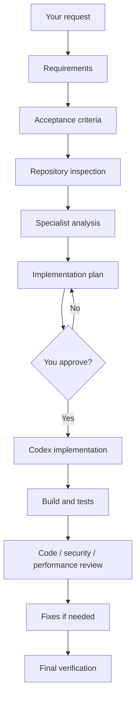
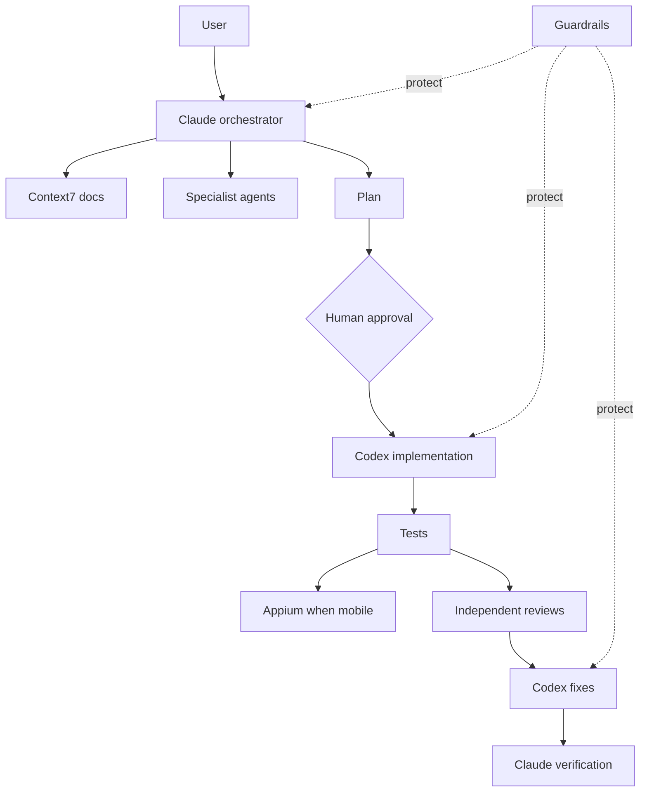

# AI Agent Workflow Kit

A practical workflow for using **Claude Code + Codex** on real software tasks without letting the agents jump straight into code.

The idea is simple:

```text
You ask for a feature
        ↓
Claude understands and plans it
        ↓
Specialist agents review the plan
        ↓
You approve the plan
        ↓
Codex implements it
        ↓
Tests + reviews verify it
        ↓
Claude gives you the final result
```

At the same time, **guardrails** protect the repository and **evals** check whether the agents actually did the job correctly.

---

## What this project gives you

| Capability | What it means |
|---|---|
| **Agentic workflow** | Work moves through requirements → plan → approval → implementation → tests → reviews → verification. |
| **Claude + Codex delegation** | Claude coordinates the work. Codex handles implementation and fixes by default. |
| **Guardrails** | Agents are blocked from dangerous actions such as reading secrets, force-pushing, bypassing hooks, or editing protected workflow files. |
| **Current documentation** | Context7 gives agents current library/framework documentation instead of relying only on model memory. |
| **Mobile QA** | Appium can verify Android/iOS acceptance criteria on an emulator, simulator, or device. |
| **Evals** | Tasks are graded from the final repository state, not from what the agent claims it did. |

---

# The main workflow

Use:

```text
/feature <your request>
```

Example:

```text
/feature Add biometric login with password fallback
```

The workflow then follows this path:



The important part is the **human approval gate**:

> No product-code implementation should start until you approve the plan.

---

# Who does what?

## Claude — orchestrator

Claude owns the workflow.

It handles things such as:

- understanding the request;
- writing requirements and acceptance criteria;
- inspecting the repository;
- asking specialist agents for analysis;
- creating the implementation plan;
- asking you for approval;
- reviewing the final implementation;
- verifying that the acceptance criteria are satisfied.

Claude is **not required to do all coding itself**.

---

## Codex — implementation and fixes

By default:

```text
Implementation → Codex
Fixes          → Codex
```

Claude delegates these jobs to Codex through the local `codex-delegate` MCP server.

The large context is stored in files under:

```text
ai/runs/<run-id>/
```

Claude passes Codex the file paths instead of copying a huge prompt back and forth.

This keeps the orchestration context smaller and makes the workflow easier to audit.

---

## Specialist agents

Claude can use focused read-only specialists before and after implementation.

Examples:

| Specialist | What it checks |
|---|---|
| Architecture | Structure, boundaries, reuse, integration points |
| Security | Auth, storage, secrets, PII, permissions, deep links |
| QA | Test cases, negative cases, verification strategy |
| Performance | Rendering, startup, networking, memory, concurrency |
| Android | Android lifecycle, permissions, native behavior |
| iOS | iOS lifecycle, permissions, native behavior |
| Backend | APIs, database, queues, reliability |
| Frontend | Web UI, state, routing, accessibility |
| Code review | Correctness, maintainability, regressions |

The workflow decides which specialists are actually needed for a task.

---

# Current documentation with Context7

AI models can know an older version of an API.

For version-sensitive questions, the workflow can use **Context7**.

Example:

```text
Repository says React Native 0.77
        ↓
Docs researcher checks Context7
        ↓
Gets current/version-specific documentation
        ↓
Writes a short decision artifact
        ↓
Claude/Codex use that evidence
```

Context7 is useful for:

- framework/library upgrades;
- deprecated APIs;
- SDK configuration;
- build settings;
- migration guides;
- APIs that may have changed recently.

The dedicated Claude agent is:

```text
.claude/agents/docs-researcher.md
```

The reusable skill is:

```text
.claude/skills/current-docs/SKILL.md
```

---

# Mobile QA with Appium

For native mobile tasks, Appium can verify behavior on Android and iOS.

```text
Acceptance criteria
        ↓
QA agent
        ↓
Appium
        ↓
Android / iOS device
        ↓
Screenshots + evidence
        ↓
PASS / FAIL / BLOCKED
```

Typical things Appium can verify:

- login flows;
- permissions;
- biometrics;
- RTL behavior;
- deep links;
- WebView/native transitions;
- background/foreground behavior;
- gestures and scrolling.

The reusable procedure is:

```text
.claude/skills/mobile-device-qc/SKILL.md
```

Appium is intentionally **role-scoped**. It is only loaded when mobile device testing is needed.

---

# What is MCP here?

You do not need to understand the MCP protocol to use this project.

Think of an MCP server as a **bridge between an AI agent and another capability**.

This project uses or supports:

| MCP | Purpose |
|---|---|
| **codex-delegate** | Claude hands implementation/fix work to Codex |
| **Context7** | Current framework/library documentation |
| **Atlassian** | Jira and Confluence context |
| **Appium** | Android/iOS device testing |
| **Playwright** | Optional browser testing |
| **GitHub** | Optional PR/CI/repository context |

The project does **not** load every MCP into every agent. Each role should only get the tools it needs.

More detail: [`ai/mcp/README.md`](ai/mcp/README.md)

---

# Guardrails

The agents run behind a shared safety layer:

```text
ai/guard.yaml
```

The guard can allow, block, or require approval for an action.

Examples of things it protects against:

- reading `.env` files and private keys;
- leaking token-shaped values;
- force-pushing shared history;
- bypassing Git hooks;
- destructive shell commands;
- publishing or deploying unexpectedly;
- modifying the guardrail/workflow files to make a task pass;
- starting implementation before the plan is approved.

Simple mental model:

```text
Agent wants to do something
          ↓
     Guard checks it
       /    |    \
   allow   ask   deny
```

You can inspect the active rules with:

```bash
npm run guard:explain
```

---

# Evals

Evals answer a different question:

> Did the agent actually solve the task?

The grader checks the real end state, for example:

- files changed;
- diff content;
- tests/verification commands;
- required artifacts;
- forbidden changes;
- final answer when relevant.

It does not simply trust the agent saying “done”.

## Fast/free health check

```bash
npm run exam:check
```

This validates the guardrails and the eval cases without running a paid live agent benchmark.

## Live comparison

```bash
node ai/evals/auto.js live --tasks coding
```

This can run the same tasks against available agents and record the results.

You can also schedule the exam, but that is an advanced/optional feature.

More detail: [`ai/README.md`](ai/README.md)

---

# Quick start

## 1. Clone

```bash
git clone https://github.com/mohamedma872/ai-agent-workflow-kit
cd ai-agent-workflow-kit
npm install
```

## 2. Create the local MCP config

```bash
cp .mcp.json.example .mcp.json
```

Do not commit real credentials into `.mcp.json`.

## 3. Validate the project

```bash
npm run guard:check
npm run guard:selftest
npm run workflow:check
npm run exam:check
```

## 4. Inspect the feature workflow

```bash
npm run workflow:show
```

## 5. Use it from Claude Code

```text
/feature <request>
```

---

# Important files

You do not need to read the whole repository to understand it.

Start with these:

| File | Why it matters |
|---|---|
| `README.md` | High-level explanation |
| `ai/workflows/feature.yaml` | Defines the feature workflow and which agent handles each role |
| `ai/agents.yaml` | Defines how Claude/Codex are launched |
| `ai/guard.yaml` | Safety rules |
| `.claude/skills/feature/SKILL.md` | Claude's orchestration procedure |
| `ai/mcp/README.md` | MCP/tool setup and role mapping |
| `ai/README.md` | Full advanced reference for guardrails and evals |

---

# Simple architecture



---

# If you want the advanced details

The root README intentionally stays simple.

Use these documents when you need internals:

- [`ai/README.md`](ai/README.md) — guard engine, eval framework, task format, exam automation and operations.
- [`ai/mcp/README.md`](ai/mcp/README.md) — Context7, Atlassian, Codex delegation, GitHub, Playwright and Appium setup.
- [`AGENTS.md`](AGENTS.md) — rules that every coding agent must follow.
- [`.claude/skills/feature/SKILL.md`](.claude/skills/feature/SKILL.md) — detailed `/feature` workflow used by Claude.

---

MIT · Mohamed Elsdody
